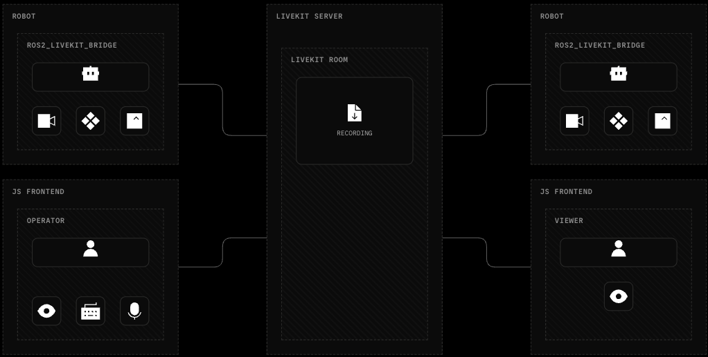

<!--BEGIN_BANNER_IMAGE-->

<picture>
  <source media="(prefers-color-scheme: dark)" srcset="/.github/banner_dark.png">
  <source media="(prefers-color-scheme: light)" srcset="/.github/banner_light.png">
  
</picture>

<!--END_BANNER_IMAGE-->

# ROS LiveKit Bridge

The ROS 2 <-> LiveKit Bridge connects a ROS2 graph to other LiveKit participants (ROS2 or not) through LiveKit’s real-time network, enabling access to a ROS graph from anywhere in the world. It streams camera feeds as video, transports arbitrary ROS messages as schema-described data, republishes remote tracks into ROS, and forwards service calls over LiveKit RPC—enabling low-latency teleoperation, monitoring, and robot-to-cloud communication without exposing DDS across networks.



## Quick Start

Open the repository in the devcontainer, then build from `/livekit_ws`:

    colcon build --packages-select ros2_livekit_bridge

Run the bridge with LiveKit credentials:

```bash
source install/setup.bash
export LIVEKIT_URL=<url>
export LIVEKIT_TOKEN=<token>
ros2 launch ros2_livekit_bridge livekit_bridge.launch.xml
```

To get familiar with using the bridge, you can follow the [tutorials](docs/tutorials.md).

## User Guides

- [Installing Debian packages](docs/installation.md): supported ROS and Ubuntu
  versions, local package installation, and the installed overlay.
- [Running](docs/running.md): launch commands, credentials, local development launch,
  and simulation examples.
- [Configuration](docs/configuration.md): YAML schema, topic routes, service routes,
  throttling, latched topics (via
  [LiveKit RPC](https://docs.livekit.io/transport/data/rpc/)), data track encoding
  (`ros2msg` / `ros2idl` / `jsonschema` for non-ROS consumers), and video options.
- [Remote ROS2 CLI calls](docs/ros2_cli_calls.md): remote `ros2` command services
  backed by [LiveKit RPC](https://docs.livekit.io/transport/data/rpc/).
- [Diagnostics](docs/diagnostics.md): `/diagnostics` fields and aggregator setup.

## Developer Guides

- [Testing](docs/testing.md): unit and integration test commands and required
  LiveKit test environment.
- [Development environment](docs/development.md): devcontainer layout, SSH agent
  forwarding, Docker image caching, and C++ tooling.
- [Debian releases](docs/releasing.md): non-publishing package builds, guarded
  GitHub prereleases, and future APT repository options.
- [Current limitations](docs/limitations.md): known implementation limits and
  follow-up work.

## Design Guides

- [Architecture](docs/design/architecture.md): bridge data flow,
  [LiveKit DataTracks](https://docs.livekit.io/transport/data/data-tracks/),
  [LiveKit RPC](https://docs.livekit.io/transport/data/rpc/), message paths, and
  QoS selection.
- [Data-track schemas](docs/design/schema.md): ROS message schema transport,
  registration, validation, and failure behavior.

## Packages of Interest

- [`ros2_livekit_bridge`](src/ros2_livekit_bridge/README.md): bridge node,
  launch files, default config, and bridge-specific tests.
- [`ros2_livekit_bridge_config`](src/ros2_livekit_bridge_config/README.md):
  schema-driven YAML config parser and generated C++ config types.
- `ros2_livekit_bridge_msgs`: custom message definitions for the bridge.
- [`ros2_livekit_bridge_tutorials`](src/ros2_livekit_bridge_tutorials/README.md):
  tutorials for using the bridge in a variety of scenarios.
- [`waveshare_launch`](src/test/waveshare_launch/README.md): a package for for launching real world and simulated 4-wheeled waveshare WAVER robot.

Other package READMEs under `src/` document package-specific setup, fixtures, or examples.
