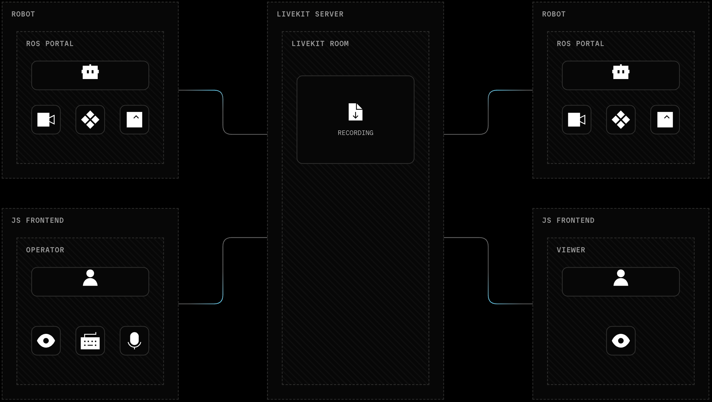

<!--BEGIN_BANNER_IMAGE-->

<picture>
  <source media="(prefers-color-scheme: dark)" srcset="/.github/banner_dark.png">
  <source media="(prefers-color-scheme: light)" srcset="/.github/banner_light.png">
  
</picture>

<!--END_BANNER_IMAGE-->

[](https://github.com/livekit/ros-portal/actions/workflows/ci.yml)
[](https://github.com/livekit/ros-portal/releases/latest)
[](https://github.com/livekit/ros-portal/releases/latest)
[](https://github.com/livekit/ros-portal/releases/latest)
[](https://github.com/livekit/ros-portal/releases/latest)

> [!IMPORTANT]
> This repository is currently in Developer Preview mode and not ready for production use.
> There may be bugs, and APIs and configuration options are subject to change during this period.

# ROS Portal

ROS Portal connects a ROS 2 graph to other LiveKit participants (ROS 2 or not)
through LiveKit's real-time network, enabling access to a ROS graph from
anywhere in the world. It forwards configured ROS topics as schema-described
[LiveKit DataTracks](https://docs.livekit.io/transport/data/data-tracks/),
republishes allowed remote tracks back into ROS, forwards configured service
calls over [LiveKit RPC](https://docs.livekit.io/transport/data/rpc/), and
streams `sensor_msgs/msg/Image` topics as LiveKit video. ROS Portal enables
low-latency teleoperation, monitoring, and robot-to-cloud communication
without exposing DDS across networks.



## Quick Start

1. **Install ROS Portal.** [Download the `.deb`](https://github.com/livekit/ros-portal/releases/latest) for your ROS 2 distro and architecture and install. See [Installation](docs/installation.md).
2. **Configure ROS Portal.** Set LiveKit credentials and a YAML config for the
   topics and services to forward. See [Configuration](docs/configuration.md).
3. **Run ROS Portal.** Start a LiveKit server or connect to your LiveKit Cloud
   project, then run. See [Running](docs/running.md).

Or run the same node from the multi-architecture Docker image for your ROS
distribution:

```bash
docker run --rm \
  --network host \
  --env LIVEKIT_URL=<url> \
  --env LIVEKIT_TOKEN=<token> \
  --volume /path/on/host/config.yaml:/config/ros_portal.yaml:ro \
  livekit/ros-portal:jazzy \
  ros2 launch ros_portal ros_portal.launch.py \
  config_path:=/config/ros_portal.yaml
```

Images are available for Humble, Jazzy, Kilted, and Lyrical on amd64 and
arm64. See [Running with Docker](docs/docker.md) for tags, networking, and
release details.

To get familiar with using ROS Portal after that, follow the
[tutorials](docs/tutorials.md).

## User Guides

- [Installation](docs/installation.md): Installing LiveKit dependencies and ROS Portal.
- [Configuration](docs/configuration.md): Configuring LiveKit environment variables
  and the ROS Portal configuration file.
- [Running](docs/running.md): Running ROS Portal against LiveKit Cloud or local server.
- [Remote ROS2 CLI calls](docs/ros2_cli_calls.md): Remote `ros2` command services
  backed by [LiveKit RPC](https://docs.livekit.io/transport/data/rpc/).
- [Diagnostics](docs/diagnostics.md): `/diagnostics` fields and aggregator setup.

## Developer Guides

- [Development](docs/development.md): devcontainer layout, SSH agent
  forwarding, Docker image caching, and C++ tooling.
- [Testing](docs/testing.md): unit and integration test commands and required
  LiveKit test environment.
- [Current limitations](docs/limitations.md): known implementation limits and
  follow-up work.

## Design Reference

- [Architecture](docs/design/architecture.md): ROS Portal data flow,
  [LiveKit DataTracks](https://docs.livekit.io/transport/data/data-tracks/),
  [LiveKit RPC](https://docs.livekit.io/transport/data/rpc/), message paths, and
  QoS selection.
- [Data-track schemas](docs/design/schema.md): ROS message schema transport,
  registration, validation, and failure behavior.

## Packages of Interest

- [`ros_portal`](src/ros_portal/README.md): ROS Portal node,
  launch files, default config, and ROS Portal-specific tests.
- [`ros_portal_config`](src/ros_portal_config/README.md):
  schema-driven YAML config parser and generated C++ config types.
- [`ros_portal_msgs`](src/ros_portal_msgs/README.md): custom service interfaces
  for remote `ros2` CLI operations.
- [`ros_portal_tutorials`](src/ros_portal_tutorials/README.md):
  tutorials for using ROS Portal in a variety of scenarios.

Other package READMEs under `src/` document package-specific setup, fixtures,
and examples.

## Robots

Complete robot stacks that consume ROS Portal live in their own repositories, so
that hardware-specific drivers, launch trees, and container images stay out of
this one:

- [`cobra_flex_ros`](https://github.com/livekit-examples/cobra_flex_ros):
  teleoperation for the Waveshare Cobra Flex rover.
- [`waver_ros`](https://github.com/livekit-examples/waver_ros): teleoperation and
  autonomous navigation for the 4-wheeled Waveshare WAVE ROVER on a Raspberry Pi.
