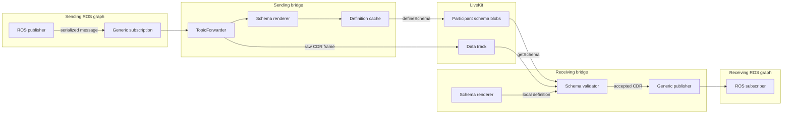
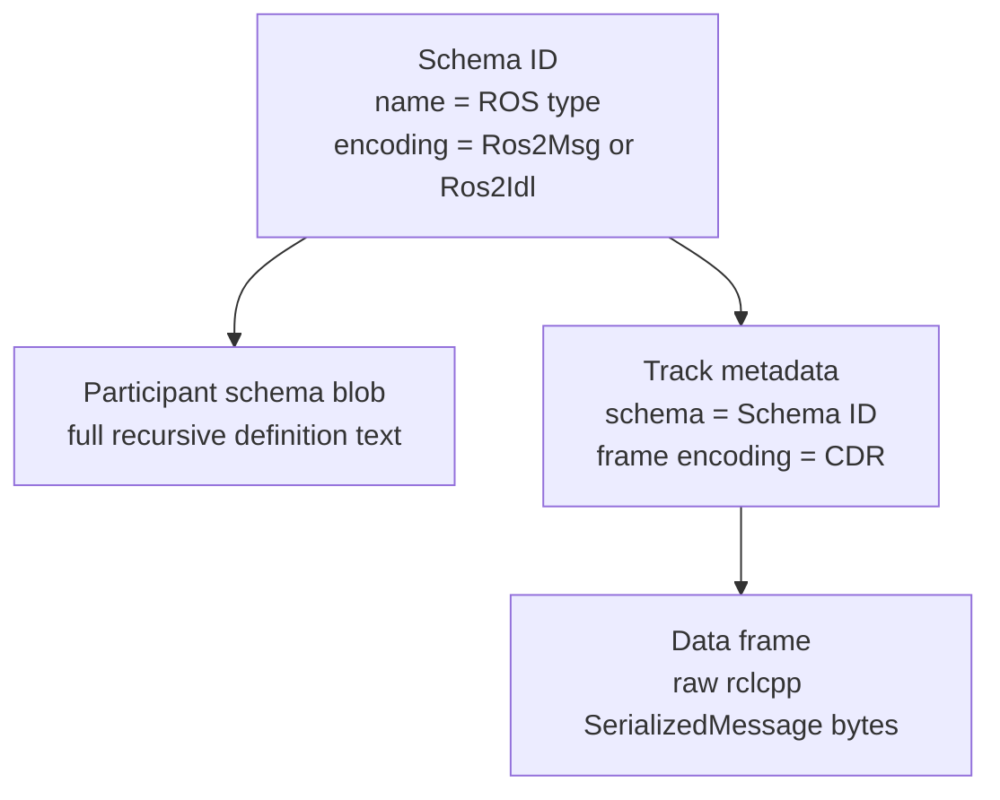
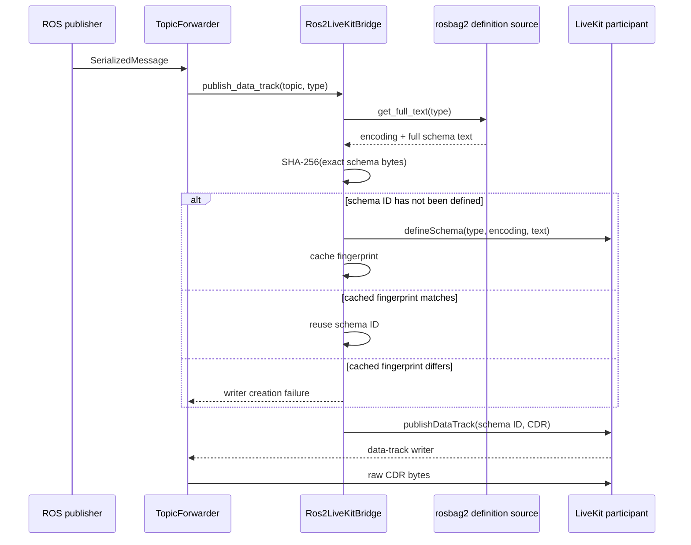
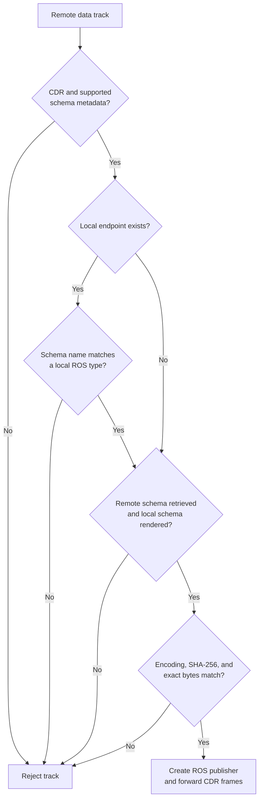

# Data Track Schema Design

## Purpose

The ROS 2 LiveKit bridge transports serialized ROS messages in LiveKit data
tracks. CDR bytes are only meaningful when the receiver knows the exact message
definition used to produce them, including every nested message type.

The schema system therefore:

- publishes a self-contained ROS message definition with each data-track type;
- labels data frames as CDR;
- rejects inbound tracks whose schema cannot be verified against the local ROS
  installation; and
- avoids registering the same schema repeatedly.

Schema handling is automatic. There is no schema-specific bridge
configuration.

## System overview



The bridge applies this path to ordinary data topics. Image topics transported
as video tracks and topics configured as `latched` use different transports and
do not use data-track schemas.

## Schema representation

The renderer accepts a ROS type name in `pkg/msg/Type` form and calls
`rosbag2_cpp::LocalMessageDefinitionSource::get_full_text()`. rosbag2 locates
the installed interface package through the local ament index and returns:

- an encoding, normally `ros2msg` or `ros2idl`; and
- the root definition followed by all recursive dependencies in MCAP message
  definition format.

For a nested message, the schema body has this general shape:

```text
# Root message definition
std_msgs/Header header
geometry_msgs/Pose pose

================================================================================
MSG: geometry_msgs/Pose
geometry_msgs/Point position
geometry_msgs/Quaternion orientation

================================================================================
MSG: geometry_msgs/Point
float64 x
float64 y
float64 z

...remaining dependencies...
```

The text is used unchanged. The bridge does not normalize whitespace, remove
comments, reorder dependencies, or replace the body with a digest.

## LiveKit data contract

Each published data track carries three related pieces of information:



For example, a `geometry_msgs/msg/PoseStamped` topic is represented as:

- schema name: `geometry_msgs/msg/PoseStamped`;
- schema encoding: `Ros2Msg` when rosbag2 reports `ros2msg`;
- schema body: the complete MCAP-format definition; and
- frame encoding: `Cdr`.

The schema body is stored as a participant data blob by LiveKit. Consequently,
the server must enable participant data blobs with
`enable_participant_data_blob: true` or the
`--enable_participant_data_blob` command-line flag.

## Outbound flow

The data-track writer is created lazily when the first ROS message arrives.



The registration cache is keyed by the rosbag2 encoding and ROS type. Its value
is the SHA-256 fingerprint of the exact schema bytes. The cache:

- is protected by a mutex because track writers may be created concurrently;
- records only successful `defineSchema()` calls;
- is scoped to the `Ros2LiveKitBridge` instance; and
- prevents a schema ID from being reused with different text.

Schema rendering itself is not cached. The renderer creates a local rosbag2
definition source for each request.

Outbound handling is fail-closed. If the local definition cannot be rendered,
schema registration fails, or LiveKit cannot create the track, no writer is
returned and the message is not sent on an untyped fallback track.

## Inbound flow

An inbound track is validated before the bridge creates a ROS publisher or
subscribes to its frames.

```mermaid
sequenceDiagram
  participant LK as Remote LiveKit track
  participant TF as TopicForwarder
  participant Graph as Local ROS graph
  participant Bridge as Ros2LiveKitBridge
  participant RB as rosbag2 definition source
  participant ROS as Local ROS topic

  LK->>TF: track published
  TF->>Graph: look for an existing type on normalized topic
  alt local endpoint already exists
    Graph-->>TF: local ROS type
  else no local endpoint yet
    TF->>TF: use schema name as candidate type
  end
  TF->>TF: check CDR, schema encoding, and type name
  TF->>Bridge: get_schema(schema ID, publisher identity)
  Bridge->>LK: getSchema(...)
  LK-->>TF: remote schema text
  TF->>RB: get_full_text(local ROS type)
  RB-->>TF: local encoding + schema text
  TF->>TF: compare encoding, SHA-256, and exact bytes

  alt all checks pass
    TF->>ROS: create generic publisher
    TF->>LK: subscribe to data frames
    LK->>ROS: republish each raw CDR frame
  else any check fails
    TF-->>TF: log rejection; create no publisher
  end
```

If the normalized topic already exists on the local ROS graph, its type takes
precedence so conflicting remote metadata is rejected. When no local endpoint
exists yet, the schema name supplies the candidate type. That candidate is not
trusted by itself: the bridge must render the named interface from its local
installation and complete exact schema validation before creating a publisher.

If the graph reports multiple types and one matches the advertised schema, the
bridge selects that type. Otherwise it warns and uses the first graph type,
which causes conflicting schema metadata to fail validation.

Validation accepts a track only when all of these checks pass:

1. The track advertises `Cdr` frame encoding.
2. A schema ID is present.
3. The schema encoding is `Ros2Msg` or `Ros2Idl`.
4. The schema name agrees with an existing local graph type, when present.
5. The remote participant's schema blob can be retrieved.
6. The same ROS type can be rendered from the local installation.
7. Remote and local schema encodings match.
8. SHA-256 fingerprints and exact schema bytes both match.

Checking both the digest and the text makes the intended byte-exact contract
explicit. The digest is also included in mismatch diagnostics, while direct
comparison remains the final authority.



### Arrival-order guarantee

Schema verification does not depend on an application publisher or subscriber
already being present on the receiving graph. The forwarder is also installed
before the bridge connects to LiveKit, because connection can emit publication
events for tracks that already exist. These orders are supported:

1. a local endpoint advertises the topic, then the remote track arrives;
2. the bridge is connected, the remote track arrives, then a local endpoint
   joins; and
3. the remote track exists first, then the bridge connects and validates it,
   then a local endpoint joins.

When no endpoint exists, the schema ID provides the type name while the locally
installed interface definition provides the trust anchor. The bridge publisher
is therefore ready for a late subscriber without weakening exact-text
validation. A later endpoint that uses a different ROS type remains incompatible
at the ROS graph level.

## Compatibility implications

Exact-text comparison is intentionally stricter than the ROS RIHS01 type hash.
Comments, whitespace, constants, defaults, dependency ordering, and all nested
definitions affect compatibility.

This design assumes:

- sender and receiver have compatible interface packages installed;
- rosbag2 renders those packages identically on both sides;
- the schema-capable LiveKit SDK is used; and
- the LiveKit server supports participant data blobs.

The bridge does not query endpoint type hashes. A semantically compatible but
textually different definition is rejected rather than risking CDR
misinterpretation.

## Failure behavior

Failures stop at the boundary where they are detected:

- rendering or registration failure prevents an outbound data track;
- missing or unsupported metadata rejects an inbound track;
- schema retrieval failure rejects an inbound track;
- local definition lookup failure rejects an inbound track; and
- any encoding or exact-text mismatch rejects an inbound track.

Rejected inbound tracks never create a local generic publisher, so
unverified CDR bytes cannot enter the local ROS graph.

## Implementation map

- Schema rendering and fingerprinting:
  [`schema_text.cpp`](../src/ros2_livekit_bridge/src/utils/schema_text.cpp) and
  [`schema_text.hpp`](../src/ros2_livekit_bridge/include/ros2_livekit_bridge/utils/schema_text.hpp)
- LiveKit schema registration and retrieval:
  [`ros2_livekit_bridge.cpp`](../src/ros2_livekit_bridge/src/ros2_livekit_bridge.cpp)
- Inbound validation and CDR forwarding:
  [`topic_forwarder.cpp`](../src/ros2_livekit_bridge/src/topic_forwarder.cpp) and
  [`topic_forwarder.hpp`](../src/ros2_livekit_bridge/include/ros2_livekit_bridge/topic_forwarder.hpp)
- Unit coverage:
  [`schema_text_test.cpp`](../src/ros2_livekit_bridge/test/unit/schema_text_test.cpp) and
  [`topic_forwarder_test.cpp`](../src/ros2_livekit_bridge/test/unit/topic_forwarder_test.cpp)
- End-to-end acceptance and rejection:
  [`bridge_e2e_test.cpp`](../src/ros2_livekit_bridge/test/integration/bridge_e2e_test.cpp)

