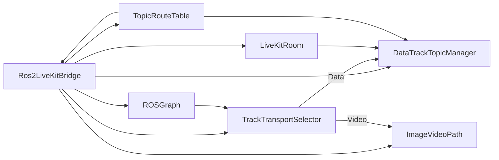
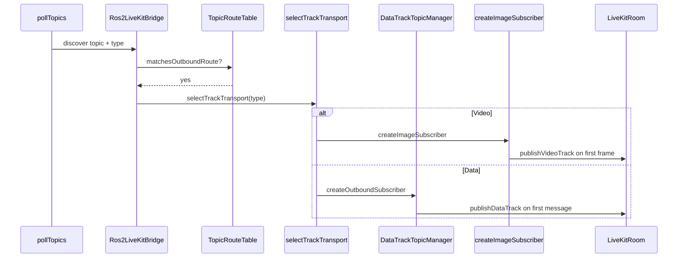
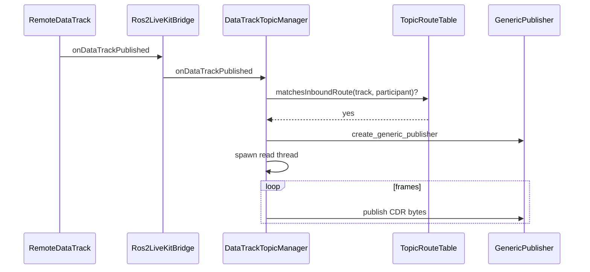

# Bridge Design

This document describes the internal architecture of the ROS2 LiveKit bridge after
the unified topic-routing and DataTrack manager refactor. For configuration
fields and examples, see [configuration.md](configuration.md).

## Goals

- **Shared topic routing** across DataTrack, VideoTrack, and future AudioTrack
  paths. Topic patterns and participant scope are compiled once and reused.
- **Isolated track managers** that own transport-specific publish/subscribe
  logic. The bridge node stays a thin orchestrator.
- **Preserved behavior** for current workloads: generic ROS messages use
  DataTracks, `sensor_msgs/msg/Image` uses VideoTracks, inbound LiveKit data
  tracks are republished as ROS generic publishers.
- **Testable seams** for routing compilation, transport selection, and manager
  lifecycle without standing up a full LiveKit room.

## Architecture



| Component | Location | Responsibility |
|---|---|---|
| `Ros2LiveKitBridge` | `src/ros2_livekit_bridge/src/ros2_livekit_bridge.cpp` | Config init, LiveKit connection, topic polling, delegate wiring, QoS, image/video path |
| `TopicRouteTable` | `src/ros2_livekit_bridge/include/ros2_livekit_bridge/utils/topic_matcher.hpp` | Compiled allow-lists for ROS→LK and LK→ROS, indexed by participant |
| `compileTopicRoutes` | `src/ros2_livekit_bridge/src/utils/ros_utils.cpp` | Config → `TopicRouteTable` adapter |
| `selectTrackTransport` | `src/ros2_livekit_bridge/include/ros2_livekit_bridge/utils/track_transport_selector.hpp` | ROS message type → Data / Video / Audio |
| `DataTrackTopicManager` | `src/ros2_livekit_bridge/include/ros2_livekit_bridge/managers/data_track_topic_manager.hpp` | Outbound generic subs, inbound data track threads, ROS generic publishers |

## Startup Sequence

1. Parse YAML config via `utils::parseBridgeConfig`.
2. Build `utils::TopicRouteTable` with `utils::compileTopicRoutes`.
3. Wire `managers::DataTrackTopicManager` with injected dependencies (node,
   room accessor, route table, callback group, QoS resolver, ROS type resolver).
4. Connect to LiveKit when `LIVEKIT_URL` and `LIVEKIT_TOKEN` are set.
5. Start a wall timer that calls `pollTopics()` at `topic_polling_period_ms`.

Topic routing is **transport-agnostic**: the same compiled table gates both data
and video subscriptions. Transport selection happens only after a topic name
matches an outgoing route.

## Topic Routing

### Compiled structures

```cpp
struct CompiledTopicRoute {
  std::string pattern;
  std::regex compiled;
  std::vector<std::string> participants;  // empty = any participant
};

struct TopicRouteTable {
  std::vector<CompiledTopicRoute> outgoing;
  std::vector<CompiledTopicRoute> incoming;
  std::vector<PatternCompileError> errors;
  std::map<std::string, std::vector<std::size_t>> outgoing_by_participant;
  std::map<std::string, std::vector<std::size_t>> incoming_by_participant;
};
```

Compilation lives in `utils::appendTopicRoute` / `utils::appendCompiledRoute`
(`topic_matcher.cpp`). Config integration is a thin loop in
`utils::compileTopicRoutes` (`ros_utils.cpp`) over `BridgeConfig::topics`,
splitting by `direction` (`out`, `in`, `bidirectional`).

### Matching rules

| Direction | Matcher | Notes |
|---|---|---|
| ROS → LiveKit | `matchesTopicRoutes(name, outgoing)` | Used during `pollTopics()` |
| LiveKit → ROS | `matchesTopicRoutesForParticipant(track, identity, incoming, incoming_by_participant)` | Participant-specific routes checked first, then wildcard (`""`) routes |

Participant index maps store **route indices**, not duplicate regexes. An empty
`participants` vector on a route registers that route under the wildcard key
`""`.

Today all config topic routes compile with an empty participant list, so every
route is wildcard-scoped. The index maps and inbound participant matching are
already wired for future config support.

### Naming helpers

Inbound LiveKit data tracks are republished on participant-prefixed ROS topics:

- `utils::normalizeTrackTopicName` — ensures a leading `/` on track names
- `utils::sanitizeRosNameToken` — makes LiveKit identities valid ROS name tokens
- `utils::liveKitToRosTopicName` — `/{sanitized_identity}{normalized_track}`

These are separate from route matching: routing selects *which* tracks to accept;
naming determines *where* inbound payloads are published on the ROS graph.

## Transport Selection

`utils::selectTrackTransport(topic_type)` is a pure function used by
`Ros2LiveKitBridge::createSubscriber`:

| ROS message type | Transport | Handler |
|---|---|---|
| `sensor_msgs/msg/Image` | `TrackTransport::Video` | `createImageSubscriber` (in bridge) |
| Known audio types (future) | `TrackTransport::Audio` | not implemented |
| Everything else | `TrackTransport::Data` | `DataTrackTopicManager::createOutboundSubscriber` |

Topic allow-listing is identical regardless of transport. Only the handler
differs once a topic is accepted.

## DataTrackTopicManager

The manager owns all DataTrack-specific state and I/O:

- **Outbound:** generic ROS subscription → lazy `LocalDataTrack` publish →
  `tryPush` of CDR-serialized bytes
- **Inbound:** `onDataTrackPublished` delegate → route/participant check → ROS
  type resolution → generic publisher → dedicated read thread per track →
  `onDataTrackUnpublished` / `shutdown` teardown

### Injected dependencies

```cpp
struct Dependencies {
  rclcpp::Node * node;
  std::function<livekit::Room *()> room_accessor;
  const utils::TopicRouteTable * topic_routes;
  rclcpp::CallbackGroup::SharedPtr callback_group;
  std::function<rclcpp::QoS(const std::string &)> qos_for_topic;
  std::function<std::optional<std::string>(const std::string &)> resolve_ros_type;
};
```

Injection keeps the manager unit-testable: route matching tests need only a
pre-built `TopicRouteTable`, not a connected room.

### Bridge integration

`Ros2LiveKitBridge` implements `livekit::RoomDelegate` and forwards data track
events to the manager:

- `onDataTrackPublished` → `data_track_manager_->onDataTrackPublished`
- `onDataTrackUnpublished` → `data_track_manager_->onDataTrackUnpublished`
- Destructor → `data_track_manager_->shutdown()` before room teardown

During polling, the bridge skips topics already managed by the data manager
(`hasOutboundSubscription`, `isInboundManagedRosTopic`) before calling
`createSubscriber`.

## Video Path

Image handling remains in `Ros2LiveKitBridge` for now:

- Typed `sensor_msgs/msg/Image` subscription (not generic)
- Lazy `VideoSource` + `LocalVideoTrack` on first frame
- Encoding conversion via `utils::convertToRgba` / `utils::makeRgbaVideoFrame`
- `VideoSource::captureFrame` on each message

A future `VideoTrackTopicManager` would follow the same pattern as
`DataTrackTopicManager`: shared routing, injected dependencies, manager-owned
state, bridge as delegate.

## Data Flows

### ROS → LiveKit (outgoing)



### LiveKit → ROS (incoming, data only)



Video and audio inbound paths are not implemented yet.

## QoS

`Ros2LiveKitBridge::determineQoS` aggregates publisher endpoints on the ROS
graph (depth sum, reliability, durability). The data manager receives QoS via
the injected `qos_for_topic` callback. Best-effort overrides come from the
`best_effort_qos_topics` ROS parameter, matched with `utils::matchesAnyPattern`.

## Extension Points

### Participant-scoped topic routes

Services already require `participant` in config. Topics do not yet. When added,
only `utils::compileTopicRoutes` needs to pass participant lists into
`appendTopicRoute`. Inbound matching already uses
`matchesTopicRoutesForParticipant`; outbound participant filtering can adopt the
same helper when needed.

### AudioTrackTopicManager

1. Add audio message types to `selectTrackTransport`.
2. Create `AudioTrackTopicManager` mirroring the data manager dependency struct.
3. Wire `TrackTransport::Audio` in `createSubscriber`.
4. Reuse the same `TopicRouteTable` — no routing changes required.

### CompressedImage → video

Add `sensor_msgs/msg/CompressedImage` to the transport selector and either
extend the image subscriber or move video logic into a dedicated manager with
decompression support.

### Inbound type validation

Today inbound ROS message types are inferred from the local ROS graph by track
name. Future hardening options (not yet implemented):

- Optional `message_type` in topic config
- Data track metadata / schema handshake when the C++ SDK supports it

## Testing

| Area | Test file |
|---|---|
| Route compilation and matching | `test/unit/topic_matcher_test.cpp`, `test/unit/test_ros_utils.cpp` |
| Transport selection | `test/unit/track_transport_selector_test.cpp` |
| DataTrack manager routing seams | `test/unit/data_track_topic_manager_test.cpp` |
| End-to-end bidirectional data | `test/integration/bridge_e2e_test.cpp` |

Run unit tests:

```bash
colcon build --packages-select ros2_livekit_bridge --cmake-args -DBUILD_TESTING=ON
colcon test --packages-select ros2_livekit_bridge --ctest-args -R ros2_livekit_bridge_unit_tests
colcon test-result --verbose
```

Integration tests require a LiveKit server and credentials; see the package
README for setup.

## Related Files

| File | Role |
|---|---|
| `include/ros2_livekit_bridge/utils/topic_matcher.hpp` | Route types, compile, match |
| `src/utils/topic_matcher.cpp` | Route compile/index implementation |
| `include/ros2_livekit_bridge/utils/ros_utils.hpp` | Config parse, route compile adapter, naming |
| `include/ros2_livekit_bridge/utils/track_transport_selector.hpp` | Message type → transport |
| `include/ros2_livekit_bridge/managers/data_track_topic_manager.hpp` | DataTrack manager API |
| `include/ros2_livekit_bridge/ros2_livekit_bridge.hpp` | Bridge orchestrator |
