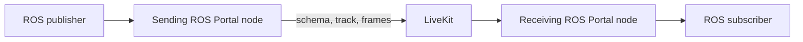
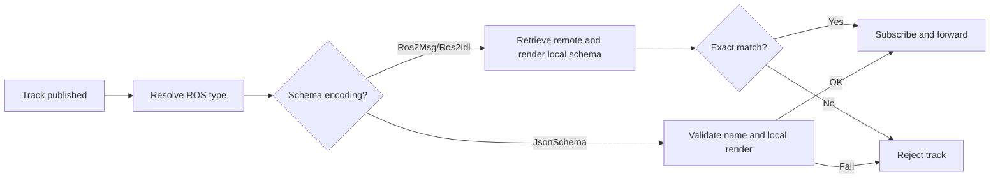

# Schema Design

## Context

A message *schema* is a formal set of rules that defines the structure, data types, and constraints of a message payload in software systems. A ROS message schema is the recursive concatenation of all the `.msg` files/types into a single definition. For example:

`robot_interfaces/msg/RobotState.msg`:

```text
string name
Pose2D pose
```

`robot_interfaces/msg/Pose2D.msg`:

```text
float64 x
float64 y
float64 theta
```

Concatenated into one schema:

```text
string name
Pose2D pose

================================================================================
MSG: robot_interfaces/Pose2D
float64 x
float64 y
float64 theta
```

The LiveKit SDK / server infrastructure supports schema definitions and retrievals. This functionality is used to enable the following features in ROS Portal:

- **Schema hash validation**: two ROS Portal participants may have different schema versions of the same topic/type. Schemas are used to verify alignment before bridging topics
- **JSON to CDR**: enables translation from JSON into CDR, such as from a web participant into a ROS graph
- **MCAP export**: natively, `ros2 bag record` embeds the schema text into `.mcap` files. Recording bridged ROS data out LiveKit can be written to MCAPs in conjunction with the schema to mirror this

## Design

Schemas protect each ordinary data track from being interpreted as the wrong
ROS message type. The sending ROS Portal node publishes the complete ROS definition;
the receiving ROS Portal node validates it against the same interface installed locally
before accepting any frames. External publishers using `JsonSchema` follow a
relaxed path that validates only the schema name and local type availability.



Image topics sent as video tracks and topics configured as `latched` use other
transports and do not follow this design.

### Sending

The sending ROS Portal node creates a LiveKit track lazily, when the first eligible ROS
message arrives:

1. Render the ROS type's complete definition, including recursive dependencies.
2. Hash the exact definition bytes with SHA-256.
3. Register the full definition with LiveKit and attach its schema ID to the
   track.
4. Mark the track as CDR and forward the current and subsequent serialized
   messages.

The hash is process-local bookkeeping. It deduplicates concurrent schema
definitions and detects an attempt to reuse the same schema ID with different
text. LiveKit receives the complete definition, not the hash.

If rendering, schema registration, or track publication fails, the current
message is dropped. The next eligible message retries because no writer was
cached.

### Receiving

When a LiveKit data track is published, the receiving ROS Portal node:

1. Resolves the expected ROS type from the local ROS graph, or uses the
   advertised schema name when no local endpoint exists.
2. Requires a supported schema ID and a `Cdr` or `Json` frame encoding.
3. For `Ros2Msg` or `Ros2Idl`:
   - retrieves the complete definition from the publishing participant;
   - renders the same ROS type from its locally installed interface package;
   - and requires the schema name, encoding, SHA-256 hash, and exact definition
     bytes to match.
4. For `JsonSchema`:
   - requires `Json` frame encoding and a schema name that matches the resolved
     ROS type;
   - renders the local ROS type to confirm the interface package is installed;
   - and does not retrieve or validate remote schema text or schema IDs.
5. Creates a ROS publisher and subscribes to frames only after validation
   succeeds.



For `Ros2Msg` and `Ros2Idl`, the exact byte comparison is authoritative. Hashes
provide a quick mismatch check and useful diagnostics, but they do not replace
schema text. `JsonSchema` tracks skip that comparison and rely on local ROS
introspection when converting JSON frames.

### Wire contract

An ordinary data track carries:

- a track name that maps to a ROS topic;
- a schema ID whose name is the ROS type;
- `Ros2Msg` or `Ros2Idl` schema encoding for ROS Portal-produced tracks, or
  `JsonSchema` for external JSON publishers;
- the complete schema definition stored on the publishing participant for
  `Ros2Msg` and `Ros2Idl` (not required for `JsonSchema`); and
- a `Cdr` or `Json` frame encoding.

ROS Portal-produced tracks use CDR with a `Ros2Msg` or `Ros2Idl` schema. An external
publisher may instead use `JsonSchema` with JSON frames: the receiving ROS Portal node
accepts the track when the schema name matches the resolved ROS type and
converts each JSON frame with local ROS introspection. Schemas IDs for json encodings are not validated to local schema IDs. If conversion to ROS messages fail, errors are logged. External publishers that
do provide a ROS definition should still use `Ros2Msg` or `Ros2Idl` with the
complete definition for strict byte-for-byte validation.

The server must enable participant data blobs with
`enable_participant_data_blob: true` or `--enable_participant_data_blob`.

### Frame handling

- CDR frames are copied into `rclcpp::SerializedMessage` unchanged.
- JSON frames are converted to CDR with runtime ROS introspection using the
  locally rendered ROS type. Invalid JSON frames are dropped without closing
  the track.

### Lifecycle and delivery

- A track can be validated before a matching ROS subscriber exists, provided
  the receiving ROS Portal node has the interface package installed.
- Existing tracks are discovered when a ROS Portal node joins LiveKit.
- A rejected inbound publication is reconsidered only after a new publication
  event, such as republishing the track or reconnecting.
- Unpublishing a track removes its ROS publisher and reader state. A later
  publication is validated from the beginning.

## Compatibility

Compatibility requires sender and receiver to produce identical rosbag2
definition text. Comments, whitespace, constants, defaults, dependency order,
and nested definitions all affect the result. This is stricter than the ROS
RIHS01 type hash.

ROS Portal also requires the schema-capable LiveKit C++ SDK and a server with
participant data blobs enabled. Setup details are in the
[running guide](../running.md#livekit-server-requirement).

## Implementation map

- Schema rendering:
  [`renderer.cpp`](../../src/ros_portal/src/schema/renderer.cpp)
- Schema registration, hashing, and validation:
  [`manager.cpp`](../../src/ros_portal/src/schema/manager.cpp)
- Track lifecycle and frame handling:
  [`topic_forwarder.cpp`](../../src/ros_portal/src/topic_forwarder.cpp)
- Runtime JSON-to-CDR conversion:
  [`introspection_utils.cpp`](../../src/ros_portal/src/introspection/introspection_utils.cpp)
- Unit and integration coverage:
  [`test/unit/schema_renderer_test.cpp`](../../src/ros_portal/test/unit/schema_renderer_test.cpp),
  [`test/unit/schema_manager_test.cpp`](../../src/ros_portal/test/unit/schema_manager_test.cpp),
  [`test/unit/topic_forwarder_test.cpp`](../../src/ros_portal/test/unit/topic_forwarder_test.cpp), and
  [`test/integration/schema_manager_test.cpp`](../../src/ros_portal/test/integration/schema_manager_test.cpp)
