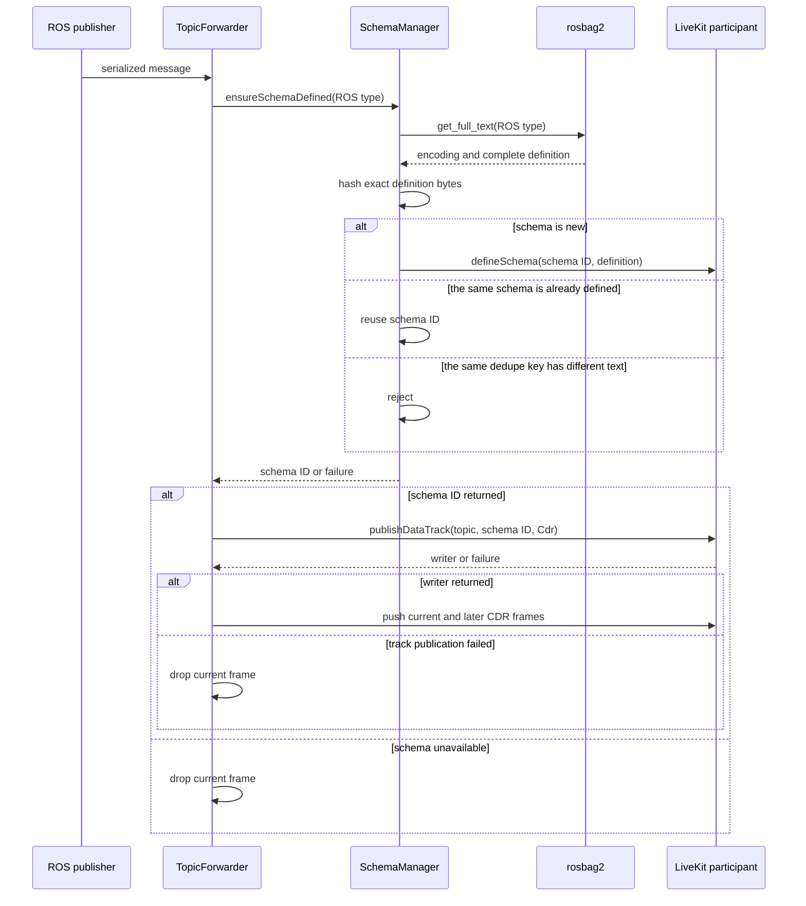
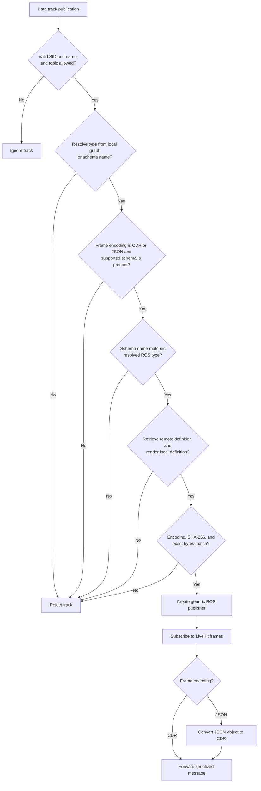

# Schema Design

## Context

A message *schema* is a formal set of rules that defines the structure, data types, and constraints of a message payload in software systems. A ROS message schema is the recursive concatenation of all the `.msg` files/types into a single definition. For example:

`robot_interfaces/msg/RobotState.msg`:

```text
string name
Pose2D pose
```

`robot_interfaces/msg/Pose2D.msg`:

```text
float64 x
float64 y
float64 theta
```

Concatenated into one schema:

```text
string name
Pose2D pose

================================================================================
MSG: robot_interfaces/Pose2D
float64 x
float64 y
float64 theta
```

The LiveKit SDK / server infrastructure supports schema definitions and retrievals. This functionality is used to enable the following features in the bridge:

- **Schema hash validation**: two bridge participants may have different versions of the same topic/type. Schemas are used to verify alignment before bridging topics
- **MCAP export**: `ros2 bag record` embeds the schema text into `.mcap` files. Recording bridged ROS data out LiveKit can be written to MCAPs in conjunction with the schema to mirror ROS Bag entirely

## Design

The bridge sends ordinary ROS 2 messages as serialized CDR bytes on LiveKit data tracks. CDR does not describe its own fields. Even with a local message receiver must know the exact ROS message definition, including nested types, before it can safely put those bytes on its local ROS graph.

For every ordinary data track, the bridge therefore:

1. publishes the complete ROS message definition as a LiveKit participant
   schema blob;
2. identifies the track's ROS type and marks its frames as CDR or JSON;
3. compares an inbound schema with the same type installed locally; and
4. forwards frames only after an exact match.

This is automatic and has no schema-specific bridge configuration. Image topics
sent as video tracks and topics configured as `latched` use other transports
and do not follow this design.

## End-to-end model

```mermaid
flowchart LR
  subgraph SendingROS["Sending ROS graph"]
    ROSPub[ROS publisher]
  end
  subgraph SendingBridge["Sending bridge"]
    Out[TopicForwarder]
    OutSchema[SchemaManager]
  end
  subgraph LiveKit
    Blob[Participant schema blob]
    Track["Data track<br/>topic name + schema ID + frame encoding"]
  end
  subgraph ReceivingBridge["Receiving bridge"]
    In[TopicForwarder]
    InSchema[SchemaManager]
    ROSOut[Generic ROS publisher]
  end
  subgraph ReceivingROS["Receiving ROS graph"]
    ROSSub[ROS subscriber]
  end

  ROSPub -->|serialized message| Out
  Out -->|render and register| OutSchema
  OutSchema -->|full definition| Blob
  Out -->|publish track and push CDR| Track
  Track -->|publication metadata| In
  In -->|validate candidate ROS type| InSchema
  Blob -->|retrieve remote definition| InSchema
  InSchema -->|validation result| In
  Track -->|subscribed frames after acceptance| In
  In -->|pass through CDR or convert JSON| ROSOut
  ROSOut --> ROSSub
```



The schema blob and track metadata establish the type contract. Frames contain
either serialized CDR or a JSON object; `SchemaManager` validates metadata and
does not carry frame payloads.

## Wire contract

A track named `/robot_pose` carrying
`geometry_msgs/msg/PoseStamped` has:

- track name `/robot_pose`;
- schema ID name `geometry_msgs/msg/PoseStamped`;
- schema ID encoding `Ros2Msg` or `Ros2Idl`;
- a participant schema blob containing the complete definition; and
- track frame encoding `Cdr` for bridge-produced tracks.

An external publisher may instead set the frame encoding to `Json` and send one
UTF-8 JSON object per frame, such as `{"data":"hello"}` for
`std_msgs/msg/String`. It must still use the ROS schema ID and full ROS schema
blob described above. `JsonSchema` does not replace ROS schema validation.

The bridge obtains the definition with
`rosbag2_cpp::LocalMessageDefinitionSource::get_full_text()`. rosbag2 reads the
installed interface package from the local ament index and returns the root
definition plus all recursive dependencies in MCAP message-definition format:

```text
std_msgs/Header header
Pose pose

================================================================================
MSG: geometry_msgs/Pose
Point position
Quaternion orientation

...remaining dependencies...
```

The bridge compares this text byte for byte. It does not remove comments,
normalize whitespace, reorder dependencies, or substitute a digest for the
text.

Outbound encoding mapping is:

- `ros2msg` to `Ros2Msg`;
- `ros2idl` to `Ros2Idl`;
- another non-empty rosbag2 encoding of at most 25 characters to the equivalent
  custom LiveKit encoding; and
- an empty or longer encoding to `Ros2Msg`.

Inbound schema validation accepts only `Ros2Msg` and `Ros2Idl`. Inbound frame
validation accepts `Cdr` and `Json`; the bridge publishes outbound frames only
as `Cdr`. A bridge can therefore publish a custom schema encoding that another
bridge will reject.

LiveKit stores schema bodies as participant data blobs. The server must enable
them with `enable_participant_data_blob: true` or
`--enable_participant_data_blob`.

## Sending a track

The bridge polls the ROS graph and creates a generic subscription for each
configured ordinary topic. It does not publish a LiveKit data track until that
subscription receives its first eligible message.



The `SchemaManager` deduplicates definitions by
`rosbag2_encoding + "\n" + ROS_type`. It stores the SHA-256 hash of the exact
text, coordinates concurrent callers so only one defines a new schema, and
retains only successful definitions. Rendering and hashing still happen on
each writer-creation attempt. The cache belongs to the bridge's single
`TopicForwarder` and lasts for that forwarder's lifetime.

After a writer is created, it is cached by ROS topic and later messages bypass
schema rendering. If rendering, schema definition, or track publication fails,
the current message is dropped and no untyped fallback is created. The writer
remains unset, so the next eligible message retries. A failed schema definition
is also removed from the definition cache before waiting callers continue.

## Receiving a track

A LiveKit track publication event starts validation. The bridge first requires
a non-empty track SID and name, normalizes the name to an absolute ROS path,
and applies the configured incoming-topic filters.

It then resolves a candidate ROS type:

- If the normalized topic already has a local publisher or subscriber, the
  graph's type takes precedence.
- If no local endpoint exists, the advertised schema name is the candidate.
- If the graph reports several types, a type matching the schema name wins;
  otherwise the first graph type is used and validation normally rejects the
  conflict.

The advertised name is never trusted on its own. The bridge must render that
type from its own installed ROS interfaces.



Acceptance requires all of the following:

1. Frame encoding is present and equals `Cdr` or `Json`.
2. A schema ID is present and uses `Ros2Msg` or `Ros2Idl`.
3. The schema name equals the resolved ROS type.
4. The remote participant's schema blob can be retrieved.
5. The same ROS type can be rendered locally.
6. Remote and local encodings match.
7. The SHA-256 hashes and exact definition bytes match.

The direct byte comparison is authoritative; hashes make mismatch diagnostics
useful. On acceptance, the bridge maps the final ROS topic name, creates a
generic publisher with `QoS(10)`, subscribes to the LiveKit track, and starts a
reader thread. With `preserve_id: true`, the mapped publication path includes
the sanitized participant identity. Type resolution still uses the original
normalized track name.

CDR payloads are copied into `rclcpp::SerializedMessage` unchanged. JSON
payloads must be non-empty JSON objects within the conversion bounds. The
bridge uses runtime ROS introspection to serialize each object as the already
validated ROS type. A malformed or incompatible JSON frame is dropped with a
diagnostic; the reader remains active for later frames.

Any failure rejects that publication event before the bridge creates a
persistent publisher or subscribes to frames. Unverified payloads cannot enter
the local ROS graph.

## Lifecycle and arrival-order cases

Schema availability and message retention are separate concerns. The bridge can
discover and validate a track in several startup orders, but ordinary data
tracks are not latched and neither side replays old frames.

JSON conversion happens only after the track's ROS schema is accepted. It does
not change any of the arrival-order behavior below.

### Local ROS endpoint exists before the inbound track

The bridge uses the graph's type as the expected type. Matching schema metadata
is accepted; a conflicting schema name or definition is rejected.

### Inbound track arrives before any local ROS endpoint

The bridge uses the schema name as a candidate, renders that type locally, and
validates it immediately. It then creates the ROS publisher without waiting for
an application subscriber. This requires the interface package to already be
installed on the receiving bridge.

### ROS subscriber joins after track acceptance

The existing bridge publisher is discoverable by the late subscriber, and
future frames are forwarded. Frames received before that subscriber matches are
not replayed because the generic publisher uses ordinary volatile `QoS(10)`.

### Track exists before the receiving bridge joins LiveKit

The bridge installs `TopicForwarder` before calling `Room::connect()`, so
publication events emitted during connection for existing tracks can be
handled. The track is validated and subscribed as usual. Frames sent before
the subscription was established are not replayed.

### Receiver has not finished validation or track subscription

The sender may push a frame immediately after publishing the track. If a
receiver has not yet retrieved and validated the schema and subscribed to the
track, that frame may be missed. Schema blobs persist for discovery; ordinary
data frames do not. Producers that require initial-state delivery must publish
again or use the configured latched-topic transport.

### ROS publisher appears after the sending bridge starts

Periodic graph polling eventually creates the bridge subscription. Messages
published before that subscription exists follow ROS QoS behavior and may be
lost. Once subscribed, the first eligible message triggers schema definition
and track creation.

### Temporary outbound failure

Rendering, `defineSchema()`, or `publishDataTrack()` failure drops the current
message. The next eligible message retries because no writer was cached.
Concurrent schema-definition callers wait for the in-progress attempt and then
reuse its success or retry after its failure.

### Temporary inbound failure or mismatch

Missing metadata, schema retrieval failure, a missing local interface, or any
mismatch rejects the track's publication event. There is no retry loop for an
already rejected event. Validation runs again only if LiveKit delivers a new
publication event, for example after the track is republished or rediscovered
on a later connection.

### Track is unpublished and later returns

Unpublishing closes the stream, joins its reader thread, and removes the
associated ROS publisher state. A later publication is resolved and validated
from the beginning.

These rules guarantee safe type handling across late joiners. They do not
guarantee delivery of frames produced before both the LiveKit stream and the
local ROS subscriber are ready.

## Compatibility

Exact-text comparison is stricter than the ROS RIHS01 type hash. Comments,
whitespace, constants, defaults, dependency order, and nested definitions all
affect compatibility. Sender and receiver must have interface packages that
rosbag2 renders identically.

The bridge also requires the pinned schema-capable LiveKit C++ SDK (or a
compatible local installation) and a server with participant data blobs
enabled. Setup details are in the
[development guide](../development.md#livekit-sdk).

## Implementation map

- Schema rendering, registration, and validation:
  [`schema_manager.cpp`](../../src/ros2_livekit_bridge/src/schema_manager.cpp)
  and
  [`schema_manager.hpp`](../../src/ros2_livekit_bridge/include/ros2_livekit_bridge/schema_manager.hpp)
- Track lifecycle, CDR forwarding, and JSON conversion:
  [`topic_forwarder.cpp`](../../src/ros2_livekit_bridge/src/topic_forwarder.cpp)
  and
  [`topic_forwarder.hpp`](../../src/ros2_livekit_bridge/include/ros2_livekit_bridge/topic_forwarder.hpp)
- Runtime JSON-to-CDR serialization:
  [`introspection_utils.cpp`](../../src/ros2_livekit_bridge/src/introspection/introspection_utils.cpp)
- LiveKit SDK adapters and connection ordering:
  [`ros2_livekit_bridge.cpp`](../../src/ros2_livekit_bridge/src/ros2_livekit_bridge.cpp)
- Unit coverage:
  [`schema_manager_test.cpp`](../../src/ros2_livekit_bridge/test/unit/schema_manager_test.cpp)
  and
  [`topic_forwarder_test.cpp`](../../src/ros2_livekit_bridge/test/unit/topic_forwarder_test.cpp)
- LiveKit integration and late-subscriber coverage:
  [`schema_manager_test.cpp`](../../src/ros2_livekit_bridge/test/integration/schema_manager_test.cpp)
