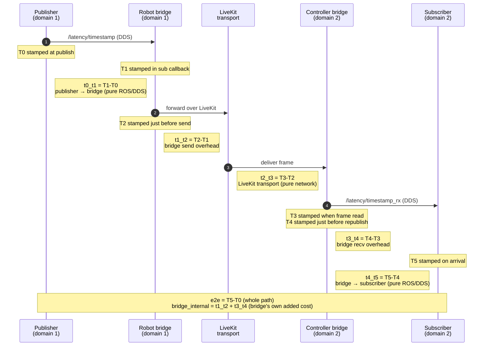

# End-to-end latency measurement

This bridge ships a self-contained latency harness that measures the real cost of
sending a message **ROS → LiveKit → ROS**, broken down into per-hop segments and
summarized as live rolling percentiles.

- Launch file: [`latency_measurement.launch.py`](../src/test/test_utilities/launch/latency_measurement.launch.py) (package `test_utilities`)
- Probe publisher (T0): [`latency_probe_publisher.py`](../src/test/test_utilities/scripts/latency_probe_publisher.py)
- Probe subscriber / stats (T5): [`latency_probe_subscriber.py`](../src/test/test_utilities/scripts/latency_probe_subscriber.py)
- Messages: [`LatencyTimestamps.msg`](../src/ros_portal_msgs/msg/LatencyTimestamps.msg), [`LatencyMetric.msg`](../src/ros_portal_msgs/msg/LatencyMetric.msg), [`LatencyStats.msg`](../src/ros_portal_msgs/msg/LatencyStats.msg)

## How it works

The launch file starts **two bridges in separate ROS domains** joined to the same
LiveKit room:

- a **robot** bridge on `ROS_DOMAIN_ID=1`
- a **controller** bridge on `ROS_DOMAIN_ID=2`

Separate domains force probe traffic across LiveKit instead of short-cutting via
local ROS discovery. Both bridge configs enable `measure_latency`.

A single probe message flows publisher → robot bridge → LiveKit → controller
bridge → subscriber. Each stage stamps its own timestamp (`T0`..`T5`) **into the
message content**, so the whole path is self-describing with no side channels. The
subscriber derives per-segment durations and publishes rolling percentiles.

> Both bridges must share a wall clock for the cross-bridge segments to be
> comparable — run them on one host (as this launch file does).

## Prerequisites

1. A built + sourced workspace:
   ```bash
   colcon build
   source install/setup.bash
   ```
2. A LiveKit server reachable at `livekit_url` (default `ws://host.docker.internal:7880`).

## Launch

```bash
ros2 launch test_utilities latency_measurement.launch.py
```

Then watch the live summary on the **controller** domain:

```bash
ROS_DOMAIN_ID=2 ros2 topic echo /ros_portal/latency/stats
```

The subscriber also logs a one-line highlight (`e2e`, `bridge_internal`, `t2_t3`)
every second.

### Launch arguments

| Argument | Default | Purpose |
|---|---|---|
| `room_name` | `latency_room` | LiveKit room both bridges join. |
| `livekit_url` | `ws://host.docker.internal:7880` | LiveKit server URL. |
| `use_dev_credentials` | `true` | Mint dev tokens instead of using real keys. |
| `robot_config` | waveshare robot yaml | Config for the `ROS_DOMAIN_ID=1` bridge. |
| `controller_config` | waveshare controller yaml | Config for the `ROS_DOMAIN_ID=2` bridge. |
| `run_probes` | `true` | Also start the probe publisher + subscriber. Set `false` to bring your own traffic. |
| `probe_rate_hz` | `100.0` | Probe publish rate. |
| `probe_payload_size` | `0` | Extra padding bytes, to sweep serialized message size. |

Example — 200 Hz probes with a 1 KB payload:

```bash
ros2 launch test_utilities latency_measurement.launch.py \
  probe_rate_hz:=200.0 probe_payload_size:=1024
```

### Subscriber tuning

Set these with `--ros-args -p name:=value` (or edit the node in the launch file):

| Parameter | Default | Purpose |
|---|---|---|
| `stats_period_sec` | `1.0` | Seconds between published summaries. |
| `window_size` | `50` | Rolling window per segment, in samples (`0` = keep all). |
| `warmup` | `20` | Samples skipped per segment before counting (excludes lazy LiveKit track setup). |

> **Reading `max` / `p99`:** these are computed over the last `window_size`
> samples. A single latency spike lifts them to a flat plateau that only drops
> once the outlier ages out of the window — so a "cyclical" square-wave in
> `max`/`p99` reflects the window, not a periodic network event. A smaller
> `window_size` makes the tail react faster.

## The T0–T5 model

Each probe carries six timestamps. This is where each is stamped and what the gap
to the next one measures:



### Segments

| Segment | Duration | Meaning |
|---|---|---|
| `t0_t1` | T1 − T0 | Publisher → sending bridge (pure ROS/DDS latency). |
| `t1_t2` | T2 − T1 | Sending bridge overhead (receive → hand off to LiveKit). |
| `t2_t3` | T3 − T2 | **LiveKit transport** — the pure network hop. Usually dominates. |
| `t3_t4` | T4 − T3 | Receiving bridge overhead (read frame → republish to ROS). |
| `t4_t5` | T5 − T4 | Receiving bridge → subscriber (pure ROS/DDS latency). |
| `bridge_internal` | t1_t2 + t3_t4 | Latency the bridge itself adds (both directions). |
| `e2e` | T5 − T0 | End-to-end, the full publisher-to-subscriber path. |

### Where the stamps come from

| Stamp | Set by | When |
|---|---|---|
| `T0` | probe publisher (domain 1) | at publish time on `/ros_portal/latency/timestamp` |
| `T1` | robot bridge | subscriber callback entry |
| `T2` | robot bridge | just before forwarding over LiveKit |
| `T3` | controller bridge | when the LiveKit frame is read |
| `T4` | controller bridge | just before republishing on `/ros_portal/latency/timestamp_rx` |
| `T5` | probe subscriber (domain 2) | on arrival of the republished probe |

## The stats message

Every `stats_period_sec`, the subscriber publishes a `LatencyStats` on
`/ros_portal/latency/stats` (latched / transient-local, so a late
subscriber gets the latest summary immediately). It carries one `LatencyMetric`
per segment, in a **fixed order** so index paths stay stable for plotting tools:

```
metrics[0] = e2e            
metrics[1] = bridge_internal
metrics[2] = t0_t1
metrics[3] = t1_t2
metrics[4] = t2_t3
metrics[5] = t3_t4
metrics[6] = t4_t5
```

Each `LatencyMetric` reports, **all in milliseconds** (the unit is carried in each
field name):

```
string  name       # segment key, e.g. "t2_t3"
uint64  count      # samples in the window
float64 p50_ms
float64 p90_ms
float64 p95_ms
float64 p99_ms
float64 min_ms
float64 max_ms
float64 mean_ms
```

### Viewing live

- **Terminal:** `ROS_DOMAIN_ID=2 ros2 topic echo /ros_portal/latency/stats`
- **Plot a single field:** PlotJuggler / rqt_plot on `metrics[*].p95_ms`
- **Foxglove:** import [`latency_stats.layout.json`](../src/test/test_utilities/foxglove/latency_stats.layout.json)
  (per-segment percentile panels + a p50 overview).

Because percentiles are precomputed on the graph, you can watch latency live or bag
the topic for post-processing with no offline math.
