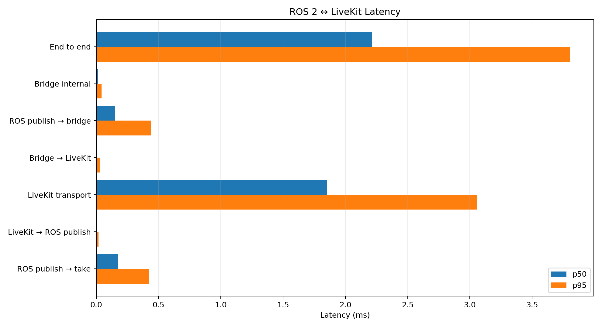

# End-to-end latency measurement

The latency harness traces the bridge's normal generic forwarding path:

```text
ROS publisher -> sending bridge -> LiveKit -> receiving bridge -> ROS subscriber
```

It does not mutate ROS messages, create reserved bridge topics, or enable a
measurement mode in bridge configuration. LTTng records four bridge-specific
events alongside selected ROS 2 core events, and an offline analyzer calculates
per-segment percentiles.

- Package: [`latency_tools`](../src/test/latency_tools)
- Launch: [`latency_measurement.launch.py`](../src/test/latency_tools/launch/latency_measurement.launch.py)
- Analyzer: [`analyze_latency_trace.py`](../src/test/latency_tools/scripts/analyze_latency_trace.py)
- Viewer: [`view_latency.py`](../src/test/latency_tools/scripts/view_latency.py)
- Test configs: [`latency_robot.yaml`](../src/test/latency_tools/config/latency_robot.yaml)
  and [`latency_controller.yaml`](../src/test/latency_tools/config/latency_controller.yaml)

## Requirements

Tracing is disabled by default. For this workflow, build the bridge with
`ROS_PORTAL_ENABLE_TRACING=ON`; otherwise the bridge tracepoints are
compiled as no-ops and the analyzer will report no correlated bridge events.
Tracing is available on Linux when `lttng-ust` is installed. The CMake
configure output must report:

```text
ros_portal tracing: LTTng enabled
```

If it reports a disabled message, install the LTTng development package and
rebuild with the option enabled. On unsupported platforms the tracepoint calls
compile to no-ops and normal forwarding is unchanged.

The launch also requires the ROS packages `tracetools_launch` and
`tracetools_read`. ROS 2 Iron and newer binary installations include the core
tracing instrumentation on Linux. Plotting a JSON report with `view_latency.py`
also requires Matplotlib.

Verify the installed bridge provider after starting a bridge:

```bash
lttng list --userspace | grep ros_portal
```

## Capture a trace

Build and source the workspace, then start a reachable LiveKit server:

```bash
colcon build --packages-up-to latency_tools \
  --cmake-args -DROS_PORTAL_ENABLE_TRACING=ON

source install/setup.bash
ros2 launch latency_tools latency_measurement.launch.py
```

The launch starts:

- a sending bridge on `ROS_DOMAIN_ID=1`;
- a receiving bridge on `ROS_DOMAIN_ID=2`;
- `ros2 topic pub` on domain 1;
- `ros2 topic hz` on domain 2; and
- an LTTng session containing only the required ROS and bridge events.

The separate ROS domains force traffic across LiveKit. Stop the launch with
Ctrl-C so the trace session is finalized. The launch log prints the trace
directory, normally below `~/.ros/tracing`.

### Launch arguments

| Argument | Default | Purpose |
|---|---|---|
| `room_name` | `latency_room` | LiveKit room used by both bridges. |
| `livekit_url` | `ws://host.docker.internal:7880` | LiveKit server URL. |
| `use_dev_credentials` | `true` | Mint development tokens. |
| `robot_config` | test latency sender config | Domain 1 bridge config. |
| `controller_config` | test latency receiver config | Domain 2 bridge config. |
| `trace_session_name` | `ros_portal_latency` | Prefix for the timestamped trace directory. |
| `probe_rate_hz` | `100.0` | Probe publication rate. |
| `probe_payload_size` | `0` | `String.data` length in bytes (ASCII workload). |

Example with 1 KiB messages at 200 Hz:

```bash
ros2 launch latency_tools latency_measurement.launch.py probe_rate_hz:=200.0 probe_payload_size:=1024
```

## Analyze the trace

```bash
ros2 run latency_tools analyze_latency_trace.py \
  ~/.ros/tracing/ros_portal_latency-YYYYMMDDHHMMSS
```

The analyzer discards the first 20 complete frames by default to exclude lazy
track/schema setup. It prints p50, p95, p99, and maximum latency for:

| Segment | Meaning |
|---|---|
| `t0_t1` | ROS publisher RMW publish to sending bridge callback. |
| `t1_t2` | Sending bridge callback to LiveKit push. |
| `t2_t3` | LiveKit transport. |
| `t3_t4` | Receiving bridge frame read to ROS publish. |
| `t4_t5` | Receiving bridge publish to final RMW take. |
| `bridge_internal` | `t1_t2 + t3_t4`. |
| `e2e` | `t5 - t0`. |

Write machine-readable output with:

```bash
ros2 run latency_tools analyze_latency_trace.py --json latency.json --csv latency.csv \
   ~/.ros/tracing/ros_portal_latency-YYYYMMDDHHMMSS
```

Use `--topic` when tracing a different configured topic and `--warmup 0` to
retain setup frames. JSON contains aggregate metrics and individual samples;
CSV contains one row per measured frame. Both outputs are optional and are
written to the paths supplied on the command line.

### Plot the results

Plot the analyzer's JSON report with:

```bash
ros2 run latency_tools view_latency.py latency.json
```

The viewer creates `latency-results.png` in the current directory, comparing
p50 and p95 latency across all seven segments. It reads the JSON report; the CSV
is intended for custom per-frame analysis.

An example of results on a local SFU:



### Regression budgets

The analyzer can act as a CI gate:

```bash
ros2 run latency_tools analyze_latency_trace.py <trace-directory> \
  --minimum-samples 30 \
  --max-bridge-p50-ms 2 \
  --max-bridge-p95-ms 10
```

It exits nonzero if too few complete frames were correlated or a configured
budget is exceeded.

## Trace events and correlation

The T0 and T5 endpoints come from the existing `ros2:rmw_publish` and
`ros2:rmw_take` events. The bridge adds:

| Event | Position |
|---|---|
| `ros_portal:outbound_received` | Generic serialized subscription callback entry (T1). |
| `ros_portal:livekit_push` | Immediately before `LocalDataTrack::tryPush` (T2). |
| `ros_portal:livekit_received` | Immediately after an inbound frame is read (T3). |
| `ros_portal:ros_publish` | Immediately before `GenericPublisher::publish` (T4). |

When these events are enabled, the sending bridge hashes the ROS publisher GID
and middleware source timestamp into a 64-bit correlation ID. LiveKit carries
that ID in `DataTrackFrame.user_timestamp`, which is application metadata
separate from the ROS payload. The receiving bridge emits the same ID at T3 and
T4.

When tracing is not active, the bridge does not calculate a correlation ID or
set `user_timestamp`; the only instrumentation cost is the disabled tracepoint
check. No clock reads, allocations, locks, or ROS publications are introduced.

The supplied launch captures all processes on one host, so LTTng event clocks
share a time base. Multi-host traces require clock synchronization and trace
alignment before cross-host `t2_t3` or `e2e` values are meaningful.
