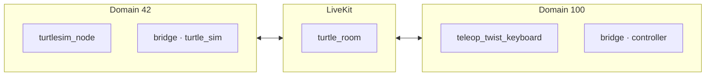

# Tutorials

## Turtlesim over LiveKit

This tutorial demonstrates the bridge capabilities by expanding upon the [ROS turtlesim beginner tutorials](https://docs.ros.org/en/foxy/Tutorials.html), running the turtlesim in one ROS graph and controlling it from a separate graph, with the two connected only through a LiveKit room.

You will run two ROS graphs on one machine, isolated by `ROS_DOMAIN_ID` so they
share no DDS traffic:

- **turtle_sim** (`ROS_DOMAIN_ID=42`): runs `turtlesim_node` and a bridge with
  `identity:=turtle_sim`.
- **controller** (`ROS_DOMAIN_ID=100`): runs a bridge with `identity:=controller`
  and drives the turtle.

Because the domains differ, the only path between them is the LiveKit room. Along
the way you'll use all three bridging mechanisms: **CLI forwarding**,
**service-call bridging through config**, and **topic bridging through config**.



### Prerequisites
- `turtlesim` and `teleop_twist_keyboard` ROS2 packages installed:
  `sudo apt install ros-$ROS_DISTRO-turtlesim ros-$ROS_DISTRO-teleop-twist-keyboard`.
- `ros2_livekit_bridge_tutorials` package built with deps: `colcon build --packages-up-to ros2_livekit_bridge_tutorials`
- A running LiveKit server. See [Running](running.md#livekit-server) for instructions.
- __optional:__ a display to view the turtlesim window.

>__Reminder:__ In every new shell, source your workspace: `source install/setup.bash`. If you are in the devcontainer, use `sros`.

---

### 1. Set up turtlesim across two domains

The `ros2_livekit_bridge_tutorials` package
([src/ros2_livekit_bridge_tutorials](../src/ros2_livekit_bridge_tutorials)) ships both configs, so
they are ready to use after a build — no editing required. This section
walks through what the configs contain. Credentials and room name are **not** in
config (see [Configuration](configuration.md)); only routes are.

__`turtle_sim_config.yaml`__ - the turtle receives velocity commands from LiveKit and exports its pose:

```yaml
ros2_livekit_bridge:
  version: "0.0.1"
  ros_threads: 4          # keep > 1 so remote CLI calls have a free executor thread

  topics:
    # Velocity commands (LiveKit -> ROS).
    - topic: "/turtle.*/cmd_vel"
      direction: "in"

    # Pose telemetry out to the controller (ROS -> LiveKit).
    - topic: "/turtle.*/pose"
      direction: "out"
```

__`turtle_sim_controller.yaml`__ - the mirror image, plus a service route that
exposes turtle_sim's `/turtle1/teleport_absolute` service as a local one (used in
step [3b](tutorials.md#3-spawn-a-turtle-service-call)):

```yaml
ros2_livekit_bridge:
  version: "0.0.1"
  ros_threads: 4

  topics:
    # Velocity commands (ROS -> LiveKit).
    - topic: "/turtle.*/cmd_vel"
      direction: "out"

    # Pose telemetry (LiveKit -> ROS).
    - topic: "/turtle.*/pose"
      direction: "in"

  services:
    - service: "/turtle2/teleport_absolute"
      direction: "out"
      participant: "turtle_sim"
      msg_type: "turtlesim/srv/TeleportAbsolute"

    - service: "/spawn"
      direction: "out"
      participant: "turtle_sim"
      msg_type: "turtlesim/srv/Spawn"
```

**Terminal A — start turtlesim** on the turtle_sim domain:

```bash
export ROS_DOMAIN_ID=42
ros2 run turtlesim turtlesim_node
```

If no display is available (e.g. a headless container or over SSH), run it with
Qt's offscreen platform so the sim still runs without a window:

```bash
export ROS_DOMAIN_ID=42
ros2 run turtlesim turtlesim_node -platform offscreen
```

**Terminal B — start the turtle_sim bridge** on the same domain, pointed at the
installed config:

```bash
export ROS_DOMAIN_ID=42
ros2 launch ros2_livekit_bridge livekit_bridge_local.launch.py \
  config:=$(ros2 pkg prefix --share ros2_livekit_bridge_tutorials)/config/turtle_sim_config.yaml \
  identity:=turtle_sim room_name:=turtle_room
```

**Terminal C — start the controller bridge** on the controller domain:

```bash
export ROS_DOMAIN_ID=100
ros2 launch ros2_livekit_bridge livekit_bridge_local.launch.py \
  config:=$(ros2 pkg prefix --share ros2_livekit_bridge_tutorials)/config/turtle_sim_controller.yaml \
  identity:=controller room_name:=turtle_room
```

Both bridges use `room_name:=turtle_room` so they meet in the same room; override
`livekit_url:` / `token:` as needed for your server (see [Running](running.md)).

__NOTE:__ on the controller graph, you don't see any pose or cmd_vel topics yet. This is because the bridge lazily publishes and subscribes to topics. You will see them in later steps.

See this for yourself, in a new terminal set the ROS_DOMAIN_ID to 42 and run `ros2 topic list`:

```bash
export ROS_DOMAIN_ID=42
ros2 topic list
```

You should see topics:
```
/diagnostics
/parameter_events
/rosout
/turtle1/cmd_vel
/turtle1/color_sensor
/turtle1/pose
```

Now, set the ROS_DOMAIN_ID to 100 and run `ros2 topic list` in the controller terminal. :
```bash
export ROS_DOMAIN_ID=100
ros2 topic list
```

You should see topics:
```bash
/diagnostics
/parameter_events
/rosout
/turtle1/pose
```

__NOTE:__ The bridge only subscribes to topics when they are first published. Since `/turtle.*/cmd_vel` direction is `out` and there are no publishers on the controller domain, the bridge does not yet have a publisher for it.

---

### 2. Inspect the remote robot (CLI forwarding)

The bridge forwards a subset of `ros2` [CLI commands](https://docs.ros.org/en/foxy/Tutorials/Beginner-CLI-Tools.html) to a remote graph
over LiveKit RPC. Each is a local ROS service named `/ros2_livekit_bridge/ros2_*`
that takes a `participant_id` (the remote identity to query). See
[Remote ROS2 CLI calls](ros2_cli_calls.md) for the full field tables.

List the turtle's services
([ros2 service list](https://docs.ros.org/en/foxy/Tutorials/Beginner-CLI-Tools/Understanding-ROS2-Services/Understanding-ROS2-Services.html#ros2-service-list)):

```bash
export ROS_DOMAIN_ID=100
ros2 service call /ros2_livekit_bridge/ros2_service_list \
  ros2_livekit_bridge_msgs/srv/Ros2ServiceList \
  "{participant_id: 'turtle_sim'}"
```

<!-- TODO: currently the response field is like:
response:
ros2_livekit_bridge_msgs.srv.Ros2ServiceList_Response(success=True, err_msg='', output='/clear\n/kill\n/reset\n/ros2_livekit_bridge/describe_parameters\n/ros2_livekit_bridge/get_parameter_types\n/ros2_livekit_bridge/get_parameters\n/ros2_livekit_bridge/get_type_description\n/ros2_livekit_bridge/list_parameters\n/ros2_livekit_bridge/ros2_interface_show\n/ros2_livekit_bridge/ros2_service_call\n/ros2_livekit_bridge/ros2_service_list\n/ros2_livekit_bridge/ros2_topic_list\n/ros2_livekit_bridge/ros2_topic_pub\n/ros2_livekit_bridge/set_parameters\n/ros2_livekit_bridge/set_parameters_atomically\n/spawn\n/turtle1/set_pen\n/turtle1/teleport_absolute\n/turtle1/teleport_relative\n/turtlesim/describe_parameters\n/turtlesim/get_parameter_types\n/turtlesim/get_parameters\n/turtlesim/get_type_description\n/turtlesim/list_parameters\n/turtlesim/set_parameters\n/turtlesim/set_parameters_atomically\n'

do we want to make this human readable? Looks like to do this, we would need user friendly utils to wrap the response because the artifact is from ros2 service call calling repr() on the whole response message object and printing it on one line, which escapes the embedded newlines as literal \n. -->

Show the `Spawn` interface ([ros2 interface show](https://docs.ros.org/en/foxy/Tutorials/Beginner-CLI-Tools/Understanding-ROS2-Services/Understanding-ROS2-Services.html#ros2-interface-show)):

```bash
ros2 service call /ros2_livekit_bridge/ros2_interface_show \
  ros2_livekit_bridge_msgs/srv/Ros2InterfaceShow \
  "{participant_id: 'turtle_sim', type: 'turtlesim/srv/Spawn'}"
```

Find the control topic
([ros2 topic list](https://docs.ros.org/en/foxy/Tutorials/Beginner-CLI-Tools/Understanding-ROS2-Topics/Understanding-ROS2-Topics.html#ros2-topic-list)):

```bash
ros2 service call /ros2_livekit_bridge/ros2_topic_list \
  ros2_livekit_bridge_msgs/srv/Ros2TopicList \
  "{participant_id: 'turtle_sim', show_types: true}"
```

The `output` field of each response is the same text you'd see running the
command directly on the turtle_sim machine — here you'll see `/turtle1/cmd_vel`
with type `geometry_msgs/msg/Twist`.

---

### 3. Spawn a turtle (service call)

Mirrors
[ros2 service call](https://docs.ros.org/en/foxy/Tutorials/Beginner-CLI-Tools/Understanding-ROS2-Services/Understanding-ROS2-Services.html#ros2-service-call).
There are two ways to reach a remote service.

**a. Ad-hoc, via CLI forwarding.** No config needed — forward a one-off call to
the named participant:

```bash
export ROS_DOMAIN_ID=100
ros2 service call /ros2_livekit_bridge/ros2_service_call \
  ros2_livekit_bridge_msgs/srv/Ros2ServiceCall \
  "{participant_id: 'turtle_sim', service: '/spawn', msg_type: 'turtlesim/srv/Spawn', payload: '{x: 2.0, y: 2.0, theta: 0.0, name: \"turtle2\"}'}"
```

Now, from the controller domain, query the robot graph's topics via CLI forwarding:
```bash
export ROS_DOMAIN_ID=100
ros2 service call /ros2_livekit_bridge/ros2_topic_list \
  ros2_livekit_bridge_msgs/srv/Ros2TopicList \
  "{participant_id: 'turtle_sim', show_types: true}"
```
Since these `pose` and `cmd_vel` topics match the regexes in the configs, you should now see them locally on the controller graph too:

```bash
export ROS_DOMAIN_ID=100
ros2 topic list
```

result:
```bash
/diagnostics
/parameter_events
/rosout
/turtle1/pose
/turtle2/pose
```

Let's make sure `turtle2` is where we spawned it:
```bash
export ROS_DOMAIN_ID=100
ros2 topic echo /turtle2/pose --once
```

**b. Through config.** The `services:` route in `turtle_sim_controller.yaml`
already stood up a local `/turtle2/teleport_absolute` server that forwards to
turtle_sim. Call it like any ordinary ROS service — no `participant_id`, no
wrapper type. Let's set the pose of `turtle2` to (5.0, 5.0, 0.0):

```bash
export ROS_DOMAIN_ID=100
ros2 service call /turtle2/teleport_absolute turtlesim/srv/TeleportAbsolute "{x: 5.0, y: 5.0, theta: 0.0}"
```
Now let's confirm it's moved to (5.0, 5.0, 0.0):

```bash
export ROS_DOMAIN_ID=100
ros2 topic echo /turtle2/pose --once
```

Use **a** for ad-hoc introspection; use **b** when a service is part of your steady
workflow and you want it to look local.

---

### 4. Drive the turtle

Because `/turtle.*/cmd_vel` is bridged (controller: `out`, turtle_sim: `in`), publishing to it on the controller is carried to turtle_sim — so the standard `ros2 topic` interfaces just work.

**[Publish](https://docs.ros.org/en/foxy/Tutorials/Beginner-CLI-Tools/Understanding-ROS2-Topics/Understanding-ROS2-Topics.html#ros2-topic-pub)** a constant command velocity for the turtle from the controller domain:

```bash
export ROS_DOMAIN_ID=100
ros2 topic pub /turtle1/cmd_vel geometry_msgs/msg/Twist \
  "{linear: {x: 2.0}, angular: {z: 1.8}}"
```
in another terminal, **[Echo](https://docs.ros.org/en/foxy/Tutorials/Beginner-CLI-Tools/Understanding-ROS2-Topics/Understanding-ROS2-Topics.html#ros2-topic-echo)** the turtle's pose from the controller domain:

```bash
export ROS_DOMAIN_ID=100
ros2 topic echo /turtle1/pose
```
you should see the turtle moving!

#### See [ros2_cli_calls.md](ros2_cli_calls.md) for the full suite of CLI commands.

### Teleop
Lets take driving one step further and use the [`teleop_twist_keyboard`](https://index.ros.org/r/teleop_twist_keyboard/) package:

```bash
export ROS_DOMAIN_ID=100
ros2 run teleop_twist_keyboard teleop_twist_keyboard --ros-args -r cmd_vel:=/turtle1/cmd_vel
```
(be sure to spam q a couple times to have some fun!)

Keystrokes on the controller now steer the turtle on the other domain, entirely
over LiveKit!

---

### Recap

| ROS 2 tutorial step | Bridge mechanism |
| --- | --- |
| `ros2 service list` | CLI forwarding (`ros2_service_list`) |
| `ros2 interface show` | CLI forwarding (`ros2_interface_show`) |
| `ros2 service call` (spawn) | CLI forwarding *or* a config `services:` route |
| `ros2 topic list` | CLI forwarding (`ros2_topic_list`) |
| `ros2 topic pub` | config topic route, or CLI forwarding (`ros2_topic_pub`) |
| `ros2 topic echo` | config topic route (`topics::topic::direction`) |
| `teleop_twist_keyboard` | config topic route (`topics::topic::direction`) |

**CLI forwarding** is best for ad-hoc, one-off introspection and calls against any
participant. **Config routes** are best for the topics and services that are part
of your steady workflow: declare them once and they behave like local ROS
resources. See [configuration.md](configuration.md) and
[ros2_cli_calls.md](ros2_cli_calls.md) for the full reference.
