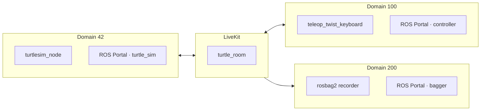

# Tutorials

## Turtlesim over LiveKit

This tutorial builds on the [ROS turtlesim beginner tutorials](https://docs.ros.org/en/foxy/Tutorials.html).
It runs turtlesim in one ROS graph and controls it from another. A third graph
records the room. The LiveKit room is their only connection.

You will run three ROS graphs on one machine, isolated by `ROS_DOMAIN_ID` so they
share no DDS traffic:

- **turtle_sim** (`ROS_DOMAIN_ID=42`): runs `turtlesim_node` and a ROS Portal node with
  `identity:=turtle_sim`.
- **controller** (`ROS_DOMAIN_ID=100`): runs a ROS Portal node with `identity:=controller`
  and drives the turtle.
- **bagger** (`ROS_DOMAIN_ID=200`): runs a ROS Portal node with `identity:=bagger`
  and records the room with rosbag2.

Because the domains differ, the only path between them is the LiveKit room. Along
the way you'll use all three bridging mechanisms: **CLI forwarding**,
**service-call bridging through config**, and **topic bridging through config**.



### Prerequisites

- Install the `turtlesim`, `teleop_twist_keyboard`, and `rosbag2` ROS 2 packages:
  `sudo apt install ros-$ROS_DISTRO-turtlesim ros-$ROS_DISTRO-teleop-twist-keyboard ros-$ROS_DISTRO-rosbag2`.
- `ros_portal_tutorials` built with its dependencies:
  `colcon build --packages-up-to ros_portal_tutorials`.
- A running LiveKit server. See [Running](running.md#livekit-server) for instructions.
- An optional display to view the turtlesim window.

> **Reminder:** In every new shell, source your workspace with
> `source install/setup.bash`. In the devcontainer, use `sros`.

You can also start the complete tutorial with Docker Compose. See the
[`ros_portal_tutorials` README](../src/ros_portal_tutorials/README.md#docker-compose)
for the token and startup commands.

---

### 1. Set up turtlesim across three domains

The `ros_portal_tutorials` package
([src/ros_portal_tutorials](../src/ros_portal_tutorials)) ships all three configs, so
they are ready to use after a build — no editing required. This section
walks through what the configs contain. Credentials and room name are **not** in
config (see [Configuration](configuration.md)); only routes are.

**`turtle_sim_config.yaml`** receives velocity commands from LiveKit and
exports the turtle's pose:

```yaml
ros_portal:
  version: "0.0.1"
  ros_threads: 4          # keep > 1 so remote CLI calls have a free executor thread

  topics:
    # Velocity commands (LiveKit -> ROS).
    - topic: "/turtle.*/cmd_vel"
      direction: "in"

    # Pose telemetry out to the controller (ROS -> LiveKit).
    - topic: "/turtle.*/pose"
      direction: "out"
```

**`turtle_sim_controller.yaml`** mirrors those topic routes and adds a service
route. The route exposes turtle_sim's `/turtle1/teleport_absolute` service
locally for use in [step 3b](#3-spawn-a-turtle-service-call):

```yaml
ros_portal:
  version: "0.0.1"
  ros_threads: 4

  topics:
    # Velocity commands (ROS -> LiveKit).
    - topic: "/turtle.*/cmd_vel"
      direction: "out"

    # Pose telemetry (LiveKit -> ROS).
    - topic: "/turtle.*/pose"
      direction: "in"

  services:
    - service: "/turtle2/teleport_absolute"
      direction: "out"
      participant: "turtle_sim"
      msg_type: "turtlesim/srv/TeleportAbsolute"

    - service: "/spawn"
      direction: "out"
      participant: "turtle_sim"
      msg_type: "turtlesim/srv/Spawn"
```

**`turtle_sim_bagger.yaml`** accepts every topic that participants publish into
the room. The bagger cannot publish its local topics back because the route is
inbound-only:

```yaml
ros_portal:
  version: "0.0.1"
  ros_threads: 4

  topics:
    - topic: ".*"
      direction: "in"
```

The wildcard does not change the export policy of another participant. The
bagger records only the topics that the turtle_sim and controller configs export.

**Terminal A — start turtlesim** on the turtle_sim domain:

```bash
export ROS_DOMAIN_ID=42
ros2 run turtlesim turtlesim_node
```

If no display is available (e.g. a headless container or over SSH), run it with
Qt's offscreen platform so the sim still runs without a window:

```bash
export ROS_DOMAIN_ID=42
ros2 run turtlesim turtlesim_node -platform offscreen
```

**Terminal B — start ROS Portal for turtle_sim** on the same domain, pointed at the
installed config:

```bash
export ROS_DOMAIN_ID=42
ros2 launch ros_portal ros_portal_local.launch.py \
  config_path:=$(ros2 pkg prefix --share ros_portal_tutorials)/config/turtle_sim_config.yaml \
  identity:=turtle_sim room_name:=turtle_room
```

**Terminal C — start ROS Portal for the controller** on the controller domain:

```bash
export ROS_DOMAIN_ID=100
ros2 launch ros_portal ros_portal_local.launch.py \
  config_path:=$(ros2 pkg prefix --share ros_portal_tutorials)/config/turtle_sim_controller.yaml \
  identity:=controller room_name:=turtle_room
```

**Terminal D — start the bagger** on a third domain:

```bash
export ROS_DOMAIN_ID=200
ros2 launch ros_portal_tutorials turtle_sim_bagger.launch.py \
  room_name:=turtle_room bag_output_dir:="$PWD/bags"
```

The launch file starts ROS Portal and `ros2 bag record -a`. It writes the bag
to `bags/turtle_room_<UTC timestamp>` and discovers topics that appear later.

All three ROS Portal nodes use `room_name:=turtle_room` to join the same room.
Override `livekit_url:` or `token:` for your server as needed; see
[Running](running.md).

> **Note:** The controller graph does not yet show pose or `cmd_vel` topics.
> ROS Portal creates publishers and subscriptions lazily; later steps create
> the endpoints that make these topics visible.

To see this, open a new terminal, set `ROS_DOMAIN_ID` to 42, and run
`ros2 topic list`:

```bash
export ROS_DOMAIN_ID=42
ros2 topic list
```

You should see topics:
```
/diagnostics
/parameter_events
/rosout
/turtle1/cmd_vel
/turtle1/color_sensor
/turtle1/pose
```

Now set `ROS_DOMAIN_ID` to 100 and run `ros2 topic list` in the controller
terminal:
```bash
export ROS_DOMAIN_ID=100
ros2 topic list
```

You should see topics:
```bash
/diagnostics
/parameter_events
/rosout
/turtle1/pose
```

> **Note:** ROS Portal discovers an outbound topic only after it is first
> published. Because the controller domain has no publisher for
> `/turtle.*/cmd_vel` yet, ROS Portal has not created its LiveKit publisher.

---

### 2. Inspect the remote robot (CLI forwarding)

ROS Portal forwards a subset of [`ros2` CLI commands](https://docs.ros.org/en/foxy/Tutorials/Beginner-CLI-Tools.html)
to a remote graph over LiveKit RPC. Each command is available through a local
ROS service named `/ros_portal/ros2_*`
that takes a `participant_id` (the remote identity to query). See
[Remote ROS 2 CLI calls](ros2_cli_calls.md) for the full field tables.

List the turtle's services
([ros2 service list](https://docs.ros.org/en/foxy/Tutorials/Beginner-CLI-Tools/Understanding-ROS2-Services/Understanding-ROS2-Services.html#ros2-service-list)):

```bash
export ROS_DOMAIN_ID=100
ros2 service call /ros_portal/ros2_service_list \
  ros_portal_msgs/srv/Ros2ServiceList \
  "{participant_id: 'turtle_sim'}"
```

Show the `Spawn` interface ([ros2 interface show](https://docs.ros.org/en/foxy/Tutorials/Beginner-CLI-Tools/Understanding-ROS2-Services/Understanding-ROS2-Services.html#ros2-interface-show)):

```bash
ros2 service call /ros_portal/ros2_interface_show \
  ros_portal_msgs/srv/Ros2InterfaceShow \
  "{participant_id: 'turtle_sim', type: 'turtlesim/srv/Spawn'}"
```

Find the control topic
([ros2 topic list](https://docs.ros.org/en/foxy/Tutorials/Beginner-CLI-Tools/Understanding-ROS2-Topics/Understanding-ROS2-Topics.html#ros2-topic-list)):

```bash
ros2 service call /ros_portal/ros2_topic_list \
  ros_portal_msgs/srv/Ros2TopicList \
  "{participant_id: 'turtle_sim', show_types: true}"
```

The `output` field of each response is the same text you'd see running the
command directly on the turtle_sim machine — here you'll see `/turtle1/cmd_vel`
with type `geometry_msgs/msg/Twist`.

---

### 3. Spawn a turtle (service call)

Mirrors
[ros2 service call](https://docs.ros.org/en/foxy/Tutorials/Beginner-CLI-Tools/Understanding-ROS2-Services/Understanding-ROS2-Services.html#ros2-service-call).
There are two ways to reach a remote service.

**a. Ad-hoc, via CLI forwarding.** No config needed — forward a one-off call to
the named participant:

```bash
export ROS_DOMAIN_ID=100
ros2 service call /ros_portal/ros2_service_call \
  ros_portal_msgs/srv/Ros2ServiceCall \
  "{participant_id: 'turtle_sim', service: '/spawn', msg_type: 'turtlesim/srv/Spawn', payload: '{x: 2.0, y: 2.0, theta: 0.0, name: \"turtle2\"}'}"
```

From the controller domain, query the robot graph's topics through CLI
forwarding:
```bash
export ROS_DOMAIN_ID=100
ros2 service call /ros_portal/ros2_topic_list \
  ros_portal_msgs/srv/Ros2TopicList \
  "{participant_id: 'turtle_sim', show_types: true}"
```
Because these `pose` and `cmd_vel` topics match the config patterns, you should
now see them on the controller graph as well:

```bash
export ROS_DOMAIN_ID=100
ros2 topic list
```

Expected output:
```bash
/diagnostics
/parameter_events
/rosout
/turtle1/pose
/turtle2/pose
```

Confirm that `turtle2` is at the requested position:
```bash
export ROS_DOMAIN_ID=100
ros2 topic echo /turtle2/pose --once
```

**b. Through config.** The `services:` route in `turtle_sim_controller.yaml`
already stood up a local `/turtle2/teleport_absolute` server that forwards to
turtle_sim. Call it like any ordinary ROS service — no `participant_id`, no
wrapper type. Let's set the pose of `turtle2` to (5.0, 5.0, 0.0):

```bash
export ROS_DOMAIN_ID=100
ros2 service call /turtle2/teleport_absolute turtlesim/srv/TeleportAbsolute "{x: 5.0, y: 5.0, theta: 0.0}"
```
Confirm that it moved to (5.0, 5.0, 0.0):

```bash
export ROS_DOMAIN_ID=100
ros2 topic echo /turtle2/pose --once
```

Use **a** for ad-hoc introspection; use **b** when a service is part of your steady
workflow and you want it to look local.

---

### 4. Drive the turtle

Because `/turtle.*/cmd_vel` is bridged (controller: `out`, turtle_sim: `in`),
messages published from the controller reach turtle_sim. The standard
`ros2 topic` interfaces therefore work without modification.

**[Publish](https://docs.ros.org/en/foxy/Tutorials/Beginner-CLI-Tools/Understanding-ROS2-Topics/Understanding-ROS2-Topics.html#ros2-topic-pub)**
a constant command velocity for the turtle from the controller domain:

```bash
export ROS_DOMAIN_ID=100
ros2 topic pub /turtle1/cmd_vel geometry_msgs/msg/Twist \
  "{linear: {x: 2.0}, angular: {z: 1.8}}"
```
In another terminal, **[echo](https://docs.ros.org/en/foxy/Tutorials/Beginner-CLI-Tools/Understanding-ROS2-Topics/Understanding-ROS2-Topics.html#ros2-topic-echo)**
the turtle's pose from the controller domain:

```bash
export ROS_DOMAIN_ID=100
ros2 topic echo /turtle1/pose
```
The turtle should now be moving.

#### See [ros2_cli_calls.md](ros2_cli_calls.md) for the full suite of CLI commands.

### Teleop

Take driving a step further with the [`teleop_twist_keyboard`](https://index.ros.org/r/teleop_twist_keyboard/)
package:

```bash
export ROS_DOMAIN_ID=100
ros2 run teleop_twist_keyboard teleop_twist_keyboard --ros-args -r cmd_vel:=/turtle1/cmd_vel
```
Press `q` a few times to increase the speed.

Keystrokes on the controller now steer the turtle on the other domain, entirely
over LiveKit!

---

### 5. Inspect the remote bag

Stop Terminal D with `Ctrl+C`. This action lets rosbag2 write the final
`metadata.yaml` file.

Terminal D prints the full recording path when it starts. Pass that path to
`ros2 bag info`:

```bash
ros2 bag info /path/printed/by/the/bagger
```

The topic list includes `/turtle1/pose` and `/turtle1/cmd_vel`. Each topic has
messages after you drive the turtle.

The recording also contains local bagger-domain topics, such as `/diagnostics`.
The bagger does not record ROS service calls because ROS Portal transports them
through LiveKit RPC.

---

### Recap

| ROS 2 tutorial step | ROS Portal mechanism |
| --- | --- |
| `ros2 service list` | CLI forwarding (`ros2_service_list`) |
| `ros2 interface show` | CLI forwarding (`ros2_interface_show`) |
| `ros2 service call` (spawn) | CLI forwarding *or* a config `services:` route |
| `ros2 topic list` | CLI forwarding (`ros2_topic_list`) |
| `ros2 topic pub` | config topic route, or CLI forwarding (`ros2_topic_pub`) |
| `ros2 topic echo` | config topic route (`topics::topic::direction`) |
| `teleop_twist_keyboard` | config topic route (`topics::topic::direction`) |
| `ros2 bag record` | inbound wildcard route on the bagger participant |

**CLI forwarding** is best for ad-hoc, one-off introspection and calls against any
participant. **Config routes** are best for the topics and services that are part
of your steady workflow: declare them once and they behave like local ROS
resources. See [configuration.md](configuration.md) and
[ros2_cli_calls.md](ros2_cli_calls.md) for the full reference.
