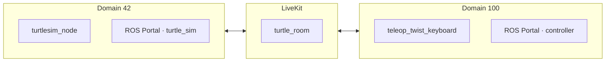
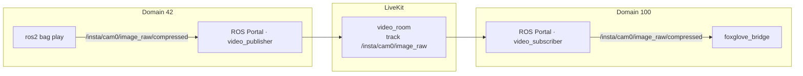

# Tutorials

## Turtlesim over LiveKit

This tutorial builds on the [ROS turtlesim beginner tutorials](https://docs.ros.org/en/foxy/Tutorials.html).
It runs turtlesim in one ROS graph and controls it from another, with a LiveKit
room as their only connection.

You will run two ROS graphs on one machine, isolated by `ROS_DOMAIN_ID` so they
share no DDS traffic:

- **turtle_sim** (`ROS_DOMAIN_ID=42`): runs `turtlesim_node` and a ROS Portal node with
  `identity:=turtle_sim`.
- **controller** (`ROS_DOMAIN_ID=100`): runs a ROS Portal node with `identity:=controller`
  and drives the turtle.

Because the domains differ, the only path between them is the LiveKit room. Along
the way you'll use all three bridging mechanisms: **CLI forwarding**,
**service-call bridging through config**, and **topic bridging through config**.


```mermaid
flowchart LR
    subgraph D42["Domain 42"]
        direction TB
        TSIM["turtlesim_node"]
        B1["ROS Portal · turtle_sim"]
    end

    subgraph LK["LiveKit"]
        ROOM["turtle_room"]
    end

    subgraph D100["Domain 100"]
        direction TB
        TELEOP["teleop_twist_keyboard"]
        B2["ROS Portal · controller"]
    end

    D42 <--> LK
    LK <--> D100
```

### Prerequisites

- `turtlesim` and `teleop_twist_keyboard` ROS 2 packages installed:
  `sudo apt install ros-$ROS_DISTRO-turtlesim ros-$ROS_DISTRO-teleop-twist-keyboard`.
- `ros_portal_tutorials` built with its dependencies:
  `colcon build --packages-up-to ros_portal_tutorials`.
- A running LiveKit server. See [Running](running.md#livekit-server) for instructions.
- An optional display to view the turtlesim window.

> **Reminder:** In every new shell, source your workspace with
> `source install/setup.bash`. In the devcontainer, use `sros`.

---

### 1. Set up turtlesim across two domains

The `ros_portal_tutorials` package
([src/ros_portal_tutorials](../src/ros_portal_tutorials)) ships both configs, so
they are ready to use after a build — no editing required. This section
walks through what the configs contain. Credentials and room name are **not** in
config (see [Configuration](configuration.md)); only routes are.

**`turtle_sim_config.yaml`** receives velocity commands from LiveKit and
exports the turtle's pose:

```yaml
ros_portal:
  version: "0.0.1"
  ros_threads: 4          # keep > 1 so remote CLI calls have a free executor thread

  topics:
    # Velocity commands (LiveKit -> ROS).
    - topic: "/turtle.*/cmd_vel"
      direction: "in"

    # Pose telemetry out to the controller (ROS -> LiveKit).
    - topic: "/turtle.*/pose"
      direction: "out"
```

**`turtle_sim_controller.yaml`** mirrors those topic routes and adds a service
route. The route exposes turtle_sim's `/turtle1/teleport_absolute` service
locally for use in [step 3b](#3-spawn-a-turtle-service-call):

__NOTE:__ `enable_ros_topic_stats: true` is optionally used for `cmd_vel` topics.

```yaml
ros_portal:
  version: "0.0.1"
  ros_threads: 4

  topics:
    # Velocity commands (ROS -> LiveKit).
    - topic: "/turtle.*/cmd_vel"
      direction: "out"
      enable_ros_topic_stats: true

    # Pose telemetry (LiveKit -> ROS).
    - topic: "/turtle.*/pose"
      direction: "in"

  services:
    - service: "/turtle2/teleport_absolute"
      direction: "out"
      participant: "turtle_sim"
      msg_type: "turtlesim/srv/TeleportAbsolute"

    - service: "/spawn"
      direction: "out"
      participant: "turtle_sim"
      msg_type: "turtlesim/srv/Spawn"
```

**Terminal A — start turtlesim** on the turtle_sim domain:

```bash
export ROS_DOMAIN_ID=42
ros2 run turtlesim turtlesim_node
```

If no display is available (e.g. a headless container or over SSH), run it with
Qt's offscreen platform so the sim still runs without a window:

```bash
export ROS_DOMAIN_ID=42
ros2 run turtlesim turtlesim_node -platform offscreen
```

**Terminal B — start ROS Portal for turtle_sim** on the same domain, pointed at the
installed config:

```bash
export ROS_DOMAIN_ID=42
ros2 launch ros_portal ros_portal_local.launch.py \
  config_path:=$(ros2 pkg prefix --share ros_portal_tutorials)/config/turtle_sim_config.yaml \
  identity:=turtle_sim room_name:=turtle_room
```

**Terminal C — start ROS Portal for the controller** on the controller domain:

```bash
export ROS_DOMAIN_ID=100
ros2 launch ros_portal ros_portal_local.launch.py \
  config_path:=$(ros2 pkg prefix --share ros_portal_tutorials)/config/turtle_sim_controller.yaml \
  identity:=controller room_name:=turtle_room
```

Both ROS Portal nodes use `room_name:=turtle_room` to join the same room.
Override `livekit_url:` or `token:` for your server as needed; see
[Running](running.md).

> **Note:** The controller graph does not yet show pose or `cmd_vel` topics.
> ROS Portal creates publishers and subscriptions lazily; later steps create
> the endpoints that make these topics visible.

To see this, open a new terminal, set `ROS_DOMAIN_ID` to 42, and run
`ros2 topic list`:

```bash
export ROS_DOMAIN_ID=42
ros2 topic list
```

You should see topics:
```
/diagnostics
/parameter_events
/rosout
/turtle1/cmd_vel
/turtle1/color_sensor
/turtle1/pose
```

Now set `ROS_DOMAIN_ID` to 100 and run `ros2 topic list` in the controller
terminal:
```bash
export ROS_DOMAIN_ID=100
ros2 topic list
```

You should see topics:
```bash
/diagnostics
/parameter_events
/rosout
/turtle1/pose
```

> **Note:** ROS Portal discovers an outbound topic only after it is first
> published. Because the controller domain has no publisher for
> `/turtle.*/cmd_vel` yet, ROS Portal has not created its LiveKit publisher.

---

### 2. Inspect the remote robot (CLI forwarding)

ROS Portal forwards a subset of [`ros2` CLI commands](https://docs.ros.org/en/foxy/Tutorials/Beginner-CLI-Tools.html)
to a remote graph over LiveKit RPC. Each command is available through a local
ROS service named `/ros_portal/ros2_*`
that takes a `participant_id` (the remote identity to query). See
[Remote ROS 2 CLI calls](ros2_cli_calls.md) for the full field tables.

List the turtle's services
([ros2 service list](https://docs.ros.org/en/foxy/Tutorials/Beginner-CLI-Tools/Understanding-ROS2-Services/Understanding-ROS2-Services.html#ros2-service-list)):

```bash
export ROS_DOMAIN_ID=100
ros2 service call /ros_portal/ros2_service_list \
  ros_portal_msgs/srv/Ros2ServiceList \
  "{participant_id: 'turtle_sim'}"
```

Show the `Spawn` interface ([ros2 interface show](https://docs.ros.org/en/foxy/Tutorials/Beginner-CLI-Tools/Understanding-ROS2-Services/Understanding-ROS2-Services.html#ros2-interface-show)):

```bash
ros2 service call /ros_portal/ros2_interface_show \
  ros_portal_msgs/srv/Ros2InterfaceShow \
  "{participant_id: 'turtle_sim', type: 'turtlesim/srv/Spawn'}"
```

Find the control topic
([ros2 topic list](https://docs.ros.org/en/foxy/Tutorials/Beginner-CLI-Tools/Understanding-ROS2-Topics/Understanding-ROS2-Topics.html#ros2-topic-list)):

```bash
ros2 service call /ros_portal/ros2_topic_list \
  ros_portal_msgs/srv/Ros2TopicList \
  "{participant_id: 'turtle_sim', show_types: true}"
```

The `output` field of each response is the same text you'd see running the
command directly on the turtle_sim machine — here you'll see `/turtle1/cmd_vel`
with type `geometry_msgs/msg/Twist`.

---

### 3. Spawn a turtle (service call)

Mirrors
[ros2 service call](https://docs.ros.org/en/foxy/Tutorials/Beginner-CLI-Tools/Understanding-ROS2-Services/Understanding-ROS2-Services.html#ros2-service-call).
There are two ways to reach a remote service.

**a. Ad-hoc, via CLI forwarding.** No config needed — forward a one-off call to
the named participant:

```bash
export ROS_DOMAIN_ID=100
ros2 service call /ros_portal/ros2_service_call \
  ros_portal_msgs/srv/Ros2ServiceCall \
  "{participant_id: 'turtle_sim', service: '/spawn', msg_type: 'turtlesim/srv/Spawn', payload: '{x: 2.0, y: 2.0, theta: 0.0, name: \"turtle2\"}'}"
```

From the controller domain, query the robot graph's topics through CLI
forwarding:
```bash
export ROS_DOMAIN_ID=100
ros2 service call /ros_portal/ros2_topic_list \
  ros_portal_msgs/srv/Ros2TopicList \
  "{participant_id: 'turtle_sim', show_types: true}"
```
Because these `pose` and `cmd_vel` topics match the config patterns, you should
now see them on the controller graph as well:

```bash
export ROS_DOMAIN_ID=100
ros2 topic list
```

Expected output:
```bash
/diagnostics
/parameter_events
/rosout
/turtle1/pose
/turtle2/pose
```

Confirm that `turtle2` is at the requested position:
```bash
export ROS_DOMAIN_ID=100
ros2 topic echo /turtle2/pose --once
```

**b. Through config.** The `services:` route in `turtle_sim_controller.yaml`
already stood up a local `/turtle2/teleport_absolute` server that forwards to
turtle_sim. Call it like any ordinary ROS service — no `participant_id`, no
wrapper type. Let's set the pose of `turtle2` to (5.0, 5.0, 0.0):

```bash
export ROS_DOMAIN_ID=100
ros2 service call /turtle2/teleport_absolute turtlesim/srv/TeleportAbsolute "{x: 5.0, y: 5.0, theta: 0.0}"
```
Confirm that it moved to (5.0, 5.0, 0.0):

```bash
export ROS_DOMAIN_ID=100
ros2 topic echo /turtle2/pose --once
```

Use **a** for ad-hoc introspection; use **b** when a service is part of your steady
workflow and you want it to look local.

---

### 4. Drive the turtle

Because `/turtle.*/cmd_vel` is bridged (controller: `out`, turtle_sim: `in`),
messages published from the controller reach turtle_sim. The standard
`ros2 topic` interfaces therefore work without modification.

**[Publish](https://docs.ros.org/en/foxy/Tutorials/Beginner-CLI-Tools/Understanding-ROS2-Topics/Understanding-ROS2-Topics.html#ros2-topic-pub)**
a constant command velocity for the turtle from the controller domain:

```bash
export ROS_DOMAIN_ID=100
ros2 topic pub /turtle1/cmd_vel geometry_msgs/msg/Twist \
  "{linear: {x: 2.0}, angular: {z: 1.8}}"
```
In another terminal, **[echo](https://docs.ros.org/en/foxy/Tutorials/Beginner-CLI-Tools/Understanding-ROS2-Topics/Understanding-ROS2-Topics.html#ros2-topic-echo)**
the turtle's pose from the controller domain:

```bash
export ROS_DOMAIN_ID=100
ros2 topic echo /turtle1/pose
```
The turtle should now be moving.

#### See [ros2_cli_calls.md](ros2_cli_calls.md) for the full suite of CLI commands.

### Teleop

Take driving a step further with the [`teleop_twist_keyboard`](https://index.ros.org/r/teleop_twist_keyboard/)
package:

```bash
export ROS_DOMAIN_ID=100
ros2 run teleop_twist_keyboard teleop_twist_keyboard --ros-args -r cmd_vel:=/turtle1/cmd_vel
```

Following the `teleop_twist_keyboard` command output for available controls,
keystrokes on the controller now steer the turtle on the other domain, entirely over LiveKit!

---

### Recap

| ROS 2 tutorial step | ROS Portal mechanism |
| --- | --- |
| `ros2 service list` | CLI forwarding (`ros2_service_list`) |
| `ros2 interface show` | CLI forwarding (`ros2_interface_show`) |
| `ros2 service call` (spawn) | CLI forwarding *or* a config `services:` route |
| `ros2 topic list` | CLI forwarding (`ros2_topic_list`) |
| `ros2 topic pub` | config topic route, or CLI forwarding (`ros2_topic_pub`) |
| `ros2 topic echo` | config topic route (`topics::topic::direction`) |
| `teleop_twist_keyboard` | config topic route (`topics::topic::direction`) |

**CLI forwarding** is best for ad-hoc, one-off introspection and calls against any
participant. **Config routes** are best for the topics and services that are part
of your steady workflow: declare them once and they behave like local ROS
resources. See [configuration.md](configuration.md) and
[ros2_cli_calls.md](ros2_cli_calls.md) for the full reference.

---

## Video pass-through over LiveKit

This tutorial sends recorded camera images from one ROS graph to another through
a LiveKit room. The images leave as `sensor_msgs/CompressedImage` and arrive as
`sensor_msgs/CompressedImage`. LiveKit carries them as a video track between the
two graphs.

You run two ROS graphs on one machine. Each launch file sets its own
`ROS_DOMAIN_ID`, so the LiveKit room is the only path between them:

- **video_publisher** (`ROS_DOMAIN_ID=42`) plays a bag and runs a ROS Portal node
  that sends the camera topic as a video track.
- **video_subscriber** (`ROS_DOMAIN_ID=100`) runs a ROS Portal node that
  republishes the video track. It also runs `foxglove_bridge` to view the images.


```mermaid
flowchart LR
    subgraph D42["Domain 42"]
        direction TB
        BAG["ros2 bag play"]
        P1["ROS Portal · video_publisher"]
        BAG -- "/insta/cam0/image_raw/compressed" --> P1
    end

    subgraph LK["LiveKit"]
        ROOM["video_room<br/>track /insta/cam0/image_raw"]
    end

    subgraph D100["Domain 100"]
        direction TB
        P2["ROS Portal · video_subscriber"]
        FOX["foxglove_bridge"]
        P2 -- "/insta/cam0/image_raw/compressed" --> FOX
    end

    P1 --> ROOM --> P2
```

### Prerequisites

- A bag with a JPEG `sensor_msgs/CompressedImage` topic named
  `/insta/cam0/image_raw/compressed`. This tutorial uses
  `data/r01_bag` in the workspace. The `data/` directory is not tracked by git.
- `ros_portal_tutorials` built with its dependencies:
  `colcon build --packages-up-to ros_portal_tutorials`.
- A running LiveKit server. See [Running](running.md#running-livekit-server).
  Start it with `--enable_participant_data_blob`.
- Optional: the Foxglove app or <https://app.foxglove.dev> to view the images.

> **Reminder:** In every new shell, source your workspace with
> `source install/setup.bash`. In the devcontainer, use `sros`.

### 1. What the configs contain

**`video_publisher.yaml`** sends the bag's camera topic out:

```yaml
topics:
  - topic: "/insta/cam0/image_raw/compressed"
    direction: "out"
```

ROS Portal decodes each JPEG and publishes the frames as one LiveKit video
track. A `CompressedImage` topic named `<base>/compressed` becomes the track
`<base>`, so the track is `/insta/cam0/image_raw`.

**`video_subscriber.yaml`** receives that track:

```yaml
topics:
  - topic: "/insta/cam0/image_raw"
    direction: "in"
```

Video tracks match by exact name, so this entry is not a regex. ROS Portal
republishes the track on `/insta/cam0/image_raw/compressed`. The topic name on
the receiver is therefore the same as on the sender. The header keeps the bag's
`stamp` and `frame_id` (see
[Inbound video](configuration.md#inbound-video)).

### 2. Start the publisher side

**Terminal A**:

```bash
ros2 launch ros_portal_tutorials video_publisher.launch.py \
  bag_path:=/livekit_ws/data/r01_bag
```

The launch file mints a token with `lk`, starts ROS Portal, and plays the bag in
a loop. The log shows the new video track:

```text
Created LiveKit video track '/insta/cam0/image_raw' from '/insta/cam0/image_raw/compressed' (1472x1440, jpeg)
```

Useful arguments:

| Argument | Default | Description |
| --- | --- | --- |
| `bag_path` | none (required) | Bag directory to play. |
| `rate` | `1.0` | Bag playback rate. |
| `loop` | `true` | Restart the bag at its end. |
| `room_name` | `video_room` | LiveKit room. Use the same value on both sides. |
| `domain_id` | `42` | `ROS_DOMAIN_ID` of this side. |

### 3. Start the subscriber side

**Terminal B**:

```bash
ros2 launch ros_portal_tutorials video_subscriber.launch.py
```

The log shows the received track. ROS Portal pauses the track while no ROS node
subscribes to the image topic:

```text
Subscribed to LiveKit video track '/insta/cam0/image_raw' from 'video_publisher'; publishing ROS topic '/insta/cam0/image_raw/compressed' [sensor_msgs/msg/CompressedImage]
Paused LiveKit video track '/insta/cam0/image_raw' from 'video_publisher'; '/insta/cam0/image_raw/compressed' has no ROS subscribers
```

To start without Foxglove, add `foxglove:=false`.

### 4. Check the received images

**Terminal C**, on the subscriber domain:

```bash
export ROS_DOMAIN_ID=100
ros2 topic hz /insta/cam0/image_raw/compressed
```

The rate is about 30 Hz, the rate of the bag. The first subscriber resumes the
paused track, and the subscriber log shows `Resumed LiveKit video track`.

Look at one message header:

```bash
ros2 topic echo --once --no-arr /insta/cam0/image_raw/compressed
```

```text
header:
  stamp:
    sec: 1769886367
    nanosec: 433493000
  frame_id: cam0
format: jpeg
```

The stamp is the time from the bag, not the current time, and `frame_id` is
`cam0`. A SLAM node can align these images with other data from the same bag.

### 5. View the images in Foxglove

The subscriber launch file starts `foxglove_bridge` on port 8765.

1. Open Foxglove and select **Open connection**.
2. Connect to `ws://localhost:8765`.
3. Add an **Image** panel and select `/insta/cam0/image_raw/compressed`.

The Image panel subscribes to the topic, so it also resumes the track.

On macOS, the devcontainer runs with `--network=host`. Docker Desktop shares
those ports with the Mac only when host networking is on. If the connection
fails, use one of these options:

- In Docker Desktop, open **Settings > Resources > Network**. Select
  **Enable host networking**, then restart Docker Desktop and the devcontainer.
- Record the received topic, then open the file in Foxglove on the Mac.
  The `data/` directory is shared with the Mac.

  ```bash
  export ROS_DOMAIN_ID=100
  ros2 bag record -s mcap -o /livekit_ws/data/received /insta/cam0/image_raw/compressed
  ```

### Recap

| Step | ROS Portal mechanism |
| --- | --- |
| `CompressedImage` to LiveKit | config topic route `out`. JPEG is decoded and sent as a video track. |
| LiveKit to `CompressedImage` | config topic route `in`, exact track name. Frames are encoded as JPEG again. |
| Same topic name on both sides | `<base>/compressed` becomes track `<base>`, and returns as `<base>/compressed`. |
| Stamps and frame_id kept | frame metadata on the video track |
| No wasted work | the receiver pauses the track while no ROS node subscribes |
